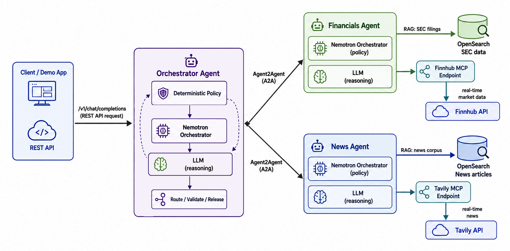

# 1. Introduction to the Solution and Prerequisites

This workshop builds a technology-company research assistant with three responsibilities: a **News Expert** finds company developments, a **Financial Expert** examines filings and market information, and an **Orchestrator Expert** delegates work and checks whether the answer is complete. A combined question can connect a company's technology activity with its reported financial results.

This is a **Mixture of Experts at the application level**: independently governed agents own different kinds of questions. The Orchestrator's **reinforcement loop** is a bounded feedback loop-plan, delegate, evaluate, and correct or stop.

In this episode, you prepare the environment that supports those experts. You will start OpenSearch, OpenSearch Dashboards, and a Python workspace container. You will also configure external inference and verify that the workspace can use it.



The diagram shows the complete solution. Its Nemotron Orchestrator and LLM Reasoning boxes represent separate **roles**. With this episode's default OpenAI configuration, both roles use `gpt-5.4`. The optional Nebius configuration uses different models for planning and generation.

## What each component does

| Component | Function in the lab | What crosses its boundary |
|---|---|---|
| Python workspace (`lab`) | Provides Python 3.12, the supplied dependencies, Git, Make, and a persistent checkout of the lab repository. Later, you will start each application process in a separate terminal inside this container. | Source files, local embeddings, API requests, retrieved evidence, and responses. |
| OpenSearch | Stores and retrieves the news and SEC-filing chunks that you ingest in later episodes. | Document chunks, metadata, embedding vectors, and retrieval queries/results. |
| OpenSearch Dashboards | Provides a browser interface for inspecting OpenSearch and running diagnostic queries. | OpenSearch API requests and inspection results. |
| External model provider | Runs the planning/verification and answer-generation models. No local text-generation model server is started. | Prompts, selected evidence, and model responses over HTTPS. |

Later, **MCP** connects each specialist to bounded tools and data. **A2A** connects the Orchestrator to those specialists. The Orchestrator only manages the coordination between the News Expert and Financials Expert and enforces the AI governance rules and policy within this solution. 

## Choose your lab environment

**Default: Podman and Compose.** Follow the instructions below on Linux, Windows, or macOS, including Apple Silicon. These are Linux containers; Podman uses a Linux virtual machine on Windows and macOS. See the [Podman machine documentation](https://docs.podman.io/en/latest/markdown/podman-machine-init.1.html).

**Alternative: host Python environment.** Follow [Native Python Setup](NATIVE_SETUP.md) to install the workspace dependencies on your machine instead of running the `lab` container. That guide reuses the two OpenSearch services and explains how to point at an existing OpenSearch installation.

### Before you begin

Install [Podman Desktop](https://podman-desktop.io/docs/installation). Enable a Compose provider using the [Podman Desktop Compose setup](https://podman-desktop.io/docs/compose/setting-up-compose). `podman compose` delegates to an external provider such as Docker Compose or `podman-compose`; installing Podman alone does not always install that provider. [Reference](https://docs.podman.io/en/latest/markdown/podman-compose.1.html)

You also need an [OpenAI API key](https://platform.openai.com/) (or an OpenAI-compatible service, such as [Nebius TokenFactory](https://tokenfactory.nebius.com/)), a [FinnHub API key](https://finnhub.io/), and a [Tavily API key](https://www.tavily.com/), for the optional configuration, with access to the chosen models and available API quota. Model validation sends small paid requests. Internet access is needed for the container images, repository clone, Python packages, model API calls, and the first embedding-model download. Tavily and Finnhub keys are **RERQUIRED** for the setup of your `.env` configuration file.

For planning purposes, reserve roughly **4 CPU cores, 8 GiB of memory, and 30 GiB of free disk space** for the container environment. These are suggested workshop allocations, not measured minimum requirements. A machine with 16 GiB of total RAM should be sufficient for the operating system and all processes within this lab.

Check the tools in a **host terminal**:

```bash
podman --version
podman compose version
podman info
```

**Expected:** Podman reports its version, a Compose provider responds, and `podman info` reaches the container engine. A provider warning naming the external Compose executable is not itself a failure. A "provider not found" error means Compose setup is incomplete.

### Windows and macOS: start the Podman machine

First inspect existing machines:

```bash
podman machine list
```

When no machine exists, initialize one and start it:

```bash
podman machine init --cpus 4 --memory 8192 --disk-size 64
podman machine start
```

When a machine already exists, start that machine rather than initializing another. Review its memory allocation in Podman Desktop. If it is already running, continue. The commands above also work in PowerShell.

### Set the OpenSearch kernel prerequisite

OpenSearch requires the Linux kernel's `vm.max_map_count` to be at least `262144`. On Windows and macOS, configure the **Podman VM**, not the host operating system. [OpenSearch installation reference](https://docs.opensearch.org/latest/install-and-configure/install-opensearch/docker/)

**Windows or macOS - host terminal:**

```bash
podman machine ssh "sudo sysctl -w vm.max_map_count=262144"
podman machine ssh "sysctl vm.max_map_count"
```

**Linux with Podman running directly on the host:**

```bash
sudo sysctl -w vm.max_map_count=262144
sysctl vm.max_map_count
```

**Expected:** `vm.max_map_count = 262144`, or a larger existing value. A temporary `sysctl -w` setting may need to be reapplied after restarting the VM or host. For a persistent Linux setting, an administrator can place `vm.max_map_count=262144` in a file under `/etc/sysctl.d/` and run `sudo sysctl --system` in the same Linux environment.

## Step 1: open the episode directory

Open the repository or extracted workshop distribution on your **host**. From its root, run:

```bash
cd 01-introduction
```

Keep this host terminal in that directory for all `podman compose` commands. It contains the supplied `docker-compose.yml`, Dockerfile, environment templates, and validation script. You do not need to write these files or install Python on the host for the default path.

The runtime image clones the workshop repository configured by its publisher. On first startup it copies that checkout into a persistent workspace at `/workspace/agentic-rag`. This is a **separate checkout from the host directory**. Editing a host source file does not automatically change the container's copy.

## Step 2: choose your external inference provider

Choose **one** of the following configurations. The `.env` file stays on the host. Compose reads its values and explicitly passes the supported variables to the `lab` container when creating it. Every later `exec` session inherits those variables; API keys are not baked into the image.

Shell environment variables take precedence over values in `.env`. Use a fresh host terminal or unset old provider exports when switching profiles. Do not paste the output of `podman compose config`, `env`, or `podman inspect` into a public issue: those commands can reveal credentials. [Compose environment precedence](https://docs.docker.com/compose/how-tos/environment-variables/variable-interpolation/)

### Option A: OpenAI - Default

**Bash or zsh:**

```bash
cp .env.openai.example .env
```

Open `.env` in your editor and replace `<YOUR_OPENAI_API_KEY>`, `<YOUR_TAVILY_API_KEY>`, and `<YOUR_FUNNHUB_API_KEY>` values. The essential configuration is:

```dotenv
USE_EXTERNAL_AI=true
USE_EXTERNAL_OPENAI=true
OPENAI_API_KEY=<YOUR_OPENAI_API_KEY>
OPENAI_MODEL=gpt-5.4

TAVILY_API_KEY=<YOUR_TAVILY_API_KEY>
FINNHUB_API_KEY=<YOUR_FUNNHUB_API_KEY>
```

Both the planning/verification role and the generation role will use OpenAI's API at `https://api.openai.com/v1`. GPT-5.4 exposes Chat Completions, the interface used by the supplied application. [Model reference](https://developers.openai.com/api/docs/models/gpt-5.4)

The template also sets these **output ceilings**:

```dotenv
EXTERNAL_ORCH_MAX_TOKENS=127000
EXTERNAL_LLM_MAX_TOKENS=127000
```

These are workshop limits, not context-window sizes. A larger model context window does not mean the same number of output tokens can be requested. [Model limits](https://developers.openai.com/api/docs/models/gpt-5.4)

The equivalent Bash/zsh exports may be used instead of editing `.env`:

```bash
export USE_EXTERNAL_AI=true
export USE_EXTERNAL_OPENAI=true
export OPENAI_API_KEY="<YOUR OPENAI API KEY>"
export OPENAI_MODEL="gpt-5.4"
export EXTERNAL_ORCH_MAX_TOKENS="127000"
export EXTERNAL_LLM_MAX_TOKENS="127000"

export TAVILY_API_KEY=<YOUR_TAVILY_API_KEY>
export FINNHUB_API_KEY=<YOUR_FUNNHUB_API_KEY>
```

Use these only in your private terminal and avoid exposing keys through screen sharing or saved shell history. The `.env` workflow works without translating `export` commands into PowerShell.

### Option B: Nebius Token Factory

Copy `.env.nebius.example` to `.env` instead and replace **both** key placeholders. You may use the same Nebius key for both roles.

```dotenv
USE_EXTERNAL_AI=true
export USE_EXTERNAL_OPENAI=false

EXTERNAL_ORCH_URL=https://api.tokenfactory.nebius.com/v1/
EXTERNAL_ORCH_API_KEY=<YOUR_NEBIUS_API_KEY>
EXTERNAL_ORCH_MODEL=nvidia/NVIDIA-Nemotron-3-Nano-30B-A3B
EXTERNAL_ORCH_MAX_TOKENS=127000

EXTERNAL_LLM_URL=https://api.tokenfactory.nebius.com/v1/
EXTERNAL_LLM_API_KEY=<YOUR_NEBIUS_API_KEY>
EXTERNAL_LLM_MODEL=Qwen/Qwen3-30B-A3B-Instruct-2507
EXTERNAL_LLM_MAX_TOKENS=127000
```

The example preserves the requested Nebius model names and ceilings; confirm current account access and endpoint limits during validation. `127000` is not a promise that either endpoint accepts that output budget for every input.

The equivalent Bash/zsh configuration is:

```bash
export USE_EXTERNAL_AI=true
export USE_EXTERNAL_OPENAI=false

export EXTERNAL_ORCH_URL="https://api.tokenfactory.nebius.com/v1/"
export EXTERNAL_ORCH_API_KEY="<YOUR NEBIUS API KEY>"
export EXTERNAL_ORCH_MODEL="nvidia/NVIDIA-Nemotron-3-Nano-30B-A3B"
export EXTERNAL_ORCH_MAX_TOKENS="127000"
export EXTERNAL_LLM_URL="https://api.tokenfactory.nebius.com/v1/"
export EXTERNAL_LLM_API_KEY="<YOUR NEBIUS API KEY>"
export EXTERNAL_LLM_MODEL="Qwen/Qwen3-30B-A3B-Instruct-2507"
export EXTERNAL_LLM_MAX_TOKENS="127000"

export TAVILY_API_KEY=<YOUR_TAVILY_API_KEY>
export FINNHUB_API_KEY=<YOUR_FUNNHUB_API_KEY>
```

Nebius documents using the OpenAI client with this API base URL. The API key and exact model identifier belong to the provider, not to the OpenAI SDK. [Nebius quickstart](https://docs.tokenfactory.nebius.com/quickstart)

### Other OpenAI-compatible APIs

The two configurations above are the workshop author's reported tested providers. The following services also document OpenAI-compatible interfaces; they are **alternatives to evaluate, not additional verified lab configurations**.

| Provider | API base URL | Provider documentation |
|---|---|---|
| Groq | `https://api.groq.com/openai/v1` | [OpenAI compatibility](https://console.groq.com/docs/openai) |
| Together AI | `https://api.together.ai/v1` | [OpenAI compatibility](https://docs.together.ai/docs/inference/openai-compatibility) |
| Fireworks AI | `https://api.fireworks.ai/inference/v1` | [OpenAI compatibility](https://docs.fireworks.ai/tools-sdks/openai-compatibility) |
| OpenRouter | `https://openrouter.ai/api/v1` | [Quickstart](https://openrouter.ai/docs/quickstart) |

For a third-party service, use `USE_EXTERNAL_AI=true` and set the URL, key, model, and output ceiling for **both** `EXTERNAL_ORCH_*` and `EXTERNAL_LLM_*`. Supply a base URL, not a URL ending in `/chat/completions`.

Compatibility is not identical behavior. Models differ in sampling parameters, token limits, structured output, reasoning behavior, and access controls. The archived clients send `max_tokens`, `temperature`, and-in several calls-`top_p`. OpenAI documents `max_tokens` as deprecated in favor of `max_completion_tokens`. The validator intentionally tests the parameters that the source actually sends; it does not hide a mismatch by using a different request shape. [API parameter reference](https://developers.openai.com/api/reference/resources/chat/subresources/completions/methods/create)

## Step 3: start the three containers

From the **host episode directory**, run:

```bash
podman compose up -d
podman compose ps
```

The first run downloads images, prepares the supplied Python workspace image, and installs the requested dependencies. Subsequent starts reuse that image unless it needs rebuilding. This command uses the provided configuration; no manual Dockerfile or Compose authoring is required.

**Expected:** three services-`opensearch`, `dashboards`, and `lab`-are running. Their container names are `opensearch-single`, `opensearch-single-dashboards`, and `agentic-lab`. Health status may show `starting` initially. Starting a container is not the same as its application being ready, so the validation step also waits for readiness.

Inspect a failing service without printing environment variables:

```bash
podman compose logs --tail 80 opensearch
podman compose logs --tail 80 dashboards
podman compose logs --tail 80 lab
```

### Understand the network

| Destination | From your host | From inside `lab` |
|---|---|---|
| OpenSearch REST API | `http://localhost:9200` | `http://opensearch-single:9200` |
| OpenSearch Dashboards | `http://localhost:5601` | `http://opensearch-single-dashboards:5601` |
| Runtime readiness | Not published to the host | `http://lab:8088/healthz` |
| Future Orchestrator API | `http://localhost:10000` | `http://127.0.0.1:10000` |
| External inference | Not used by the host in this path | Your configured HTTPS API base URL |

Inside a container, `localhost` refers to that container. Therefore, `OPENSEARCH_HOST` is `opensearch-single`, not `localhost`. Later, the specialists, their MCP servers, and the Orchestrator all run inside the **same** `lab` container, so their existing loopback addresses remain valid. Publishing port `10000` reserves access for a later episode; no Orchestrator listens there yet.

## Step 4: enter the Python workspace

From the **host episode directory**:

```bash
podman compose exec lab bash
```

Now run these commands **inside the container**:

```bash
pwd
python --version
python -m pip check
ls news_agent financials_agent orchestrator_agent
```

**Expected:** the working directory is `/workspace/agentic-rag`, Python reports `3.12.x`, pip reports no broken requirements, and all three application directories exist.

To open another session, use a **new host terminal**, return to this episode directory, and repeat:

```bash
podman compose exec lab bash
```

Each command opens a shell in the **same container and repository**, not a new container. This is how later episodes keep a server running in one terminal while a client runs in another. Shell-local exports do not propagate to sibling shells, so configure provider values through Compose before opening those sessions. Leaving a shell with `exit` does not stop the workspace container. Do not close a future service's foreground terminal while that service is still needed.

## Step 5: validate the environment

Run **inside the container**:

```bash
python /opt/lab/validate_setup.py
```

The validator checks Python and the requested package versions, imports the ML dependencies, checks the three agent configurations in separate Python processes, and verifies governance remains enabled. It connects to OpenSearch, accepts green or yellow health for this single-node lab, and performs a temporary Lucene HNSW vector-index round trip. It deletes that temporary index afterward. It also checks Dashboards readiness and the workspace's private health endpoint.

For inference, it captures the real model-call parameters from the repository's clients without sending their original prompts. It then submits a short readiness prompt using each distinct request profile. Both ORCH and LLM roles are covered, including different parameters used by the specialists and Orchestrator. **These are paid model calls.** By default, each probe has an output/reasoning ceiling of 512 tokens and no automatic network retries. Identical request profiles are tested once.

An illustrative successful run ends with:

```text
[PASS] Python: 3.12.x on Linux/...
[PASS] Dependencies: ...
[PASS] OpenSearch: ... cluster green ...
[PASS] OpenSearch vector read/write: ...
[PASS] OpenSearch Dashboards: ...
[PASS] User container: ...
[PASS] Model: ...
[WARN] Full output ceilings: ...
[SKIP] Embedding model download: Optional. ...
[SKIP] Later-episode services: ...

READY FOR EPISODE 2
```

This is example output, not a promise that an unconfigured provider account will pass. A warning about full output ceilings means the small probes did not certify a provider's larger configured token budget. Optional embedding checks and later-episode service checks are skipped intentionally.

| Exit code | Meaning | Next action |
|---|---|---|
| `0` | Required Episode 1 checks passed. | Continue, after reviewing warnings. |
| `1` | At least one required check failed. | Resolve the reported failure and rerun. |
| `2` | Infrastructure checks completed, but model checks were deliberately skipped. | Run without `--skip-models` before continuing. |

For an infrastructure-only check without model API charges:

```bash
python /opt/lab/validate_setup.py --skip-models
```

To also download/cache the embedding model and validate a finite, normalized vector using the repository's own embedding wrapper:

```bash
python /opt/lab/validate_setup.py --check-embeddings
```

The first embedding check can take several minutes and requires disk space for the weights. Later checks reuse the cache. This option is useful before Episode 2; a normal successful run verifies package imports but does not claim that model weights have already been downloaded.


### Troubleshoot the failed check, not a different layer

| Symptom | Likely issue and action |
|---|---|
| OpenSearch logs mention `vm.max_map_count` | Apply the kernel setting in the Linux environment running Podman, then restart `opensearch`. |
| Container exits with code 137 or a service repeatedly restarts | Inspect logs and available VM/host memory; increase the allocation before rerunning. |
| Port or container name already in use | Stop the earlier lab instance. For containers created by the original Bash function, deliberately remove the old named containers before starting Compose; keep their data directories. Do not run both stacks at once. |
| `opensearch-single` cannot resolve | Run the validator inside `lab`, or use `--native` with host addresses. Confirm all three services use the Compose network. |
| Dashboards is "not ready yet" | Let OpenSearch become ready first, inspect both logs, and rerun validation. A browser page loading alone does not prove its OpenSearch connection works. |
| Workspace is unwritable | The runtime uses UID 1000. Check named-volume ownership or the permissions of any optional bind mounts; do not solve this by making directories world-writable. |
| Provider HTTP 401/403 | Check the selected provider, key, project permissions, and access to the exact model. Keep the key private. |
| Provider HTTP 404 | Check the model identifier and API base URL; do not append `/chat/completions` to a base URL variable. |
| Provider HTTP 429 | Inspect quota, account billing status, or rate limits; repeated immediate retries will not repair missing quota. |
| Provider rejects `max_tokens`, `temperature`, or `top_p` | This is an application/provider request-compatibility issue, not an OpenSearch failure. The archived clients send those fields. Use a source revision with reviewed provider-aware request handling or an accepted model configuration, then rerun. The setup scripts do not rewrite agent source or silently strip parameters. |
| Provider rejects a token budget | Lower `EXTERNAL_ORCH_MAX_TOKENS` and/or `EXTERNAL_LLM_MAX_TOKENS` to supported output limits, then recreate `lab`. Context-window size is not the output limit. |
| Provider TLS or connection error | Check outbound HTTPS, DNS, proxy settings, and trusted certificate configuration. Do not disable TLS verification to bypass the error. |
| An embedding download or inference fails | Check internet access, cache disk space, package imports, and available memory; rerun `--check-embeddings`. |

After changing provider variables in the **host** `.env` file, recreate only the workspace container:

```bash
podman compose up -d --force-recreate --no-deps lab
podman compose exec lab bash
```

Container recreation terminates any running application processes and existing shells. The workspace and model cache remain in their volumes. Reopen shells and restart any later-episode services. `podman compose restart lab` does **not** apply a changed container environment.

## Pause or stop the lab

Exit container shells, then run these commands from the **host episode directory**.

To stop the services while keeping their containers and data:

```bash
podman compose stop
```

To resume:

```bash
podman compose start
```

To remove the containers and network while preserving named volumes:

```bash
podman compose down
```

Run `podman compose up -d` to recreate them.

## What you learned and what comes next

You now have a shared network, a reproducible Python workspace, and separate configuration for planning and generation.

A successful Episode 1 run means the infrastructure and model requests passed.

Continue to [Episode 2: News Expert](../2-news-agent/README.md), or return to the [workshop episode index](../README.md#episodes). 
