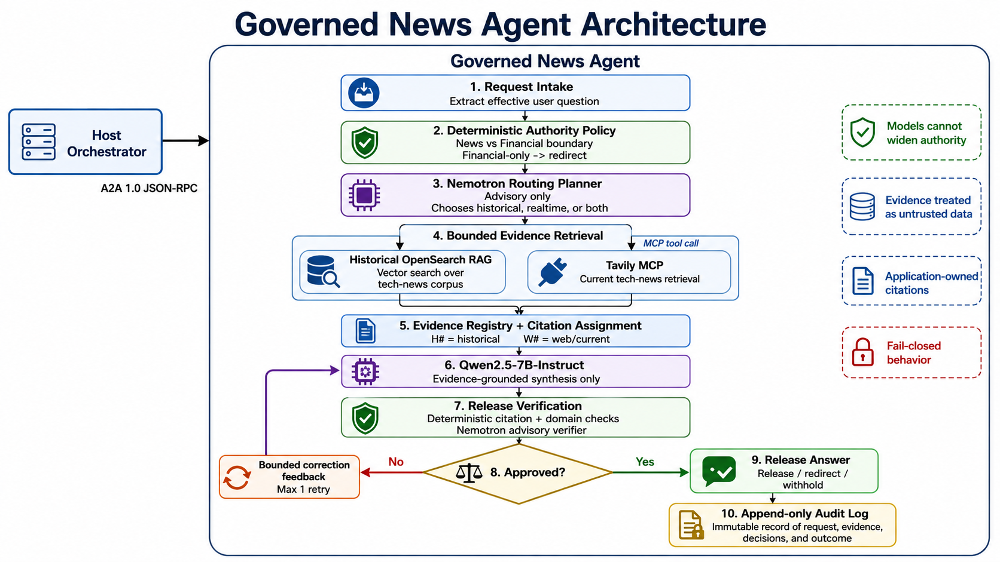

# Episode 2: News Expert

A useful research answer needs more than relevant text. It needs the right subject authority, evidence from the right time period, and a record of how that evidence became an answer. A model can have accurate facts and still produce an inappropriate conclusion when those boundaries are missing.

In this episode, you run the **News Expert**, an independently governed technology-news agent. It combines a historical news corpus in OpenSearch with real-time information retrieved through [Tavily](https://www.tavily.com/) over the internet; Tavily is a real-time API for AI to query in human language to obtain answers. You will inspect each retrieval path, start the expert, ask questions, and trace an answer through its citations and audit record.

This is one expert in the labs's **application-level Mixture of Experts (MoE)** architecture. Here, an expert is an application with a defined responsibility, bounded tools, evidence requirements, and its own validation workflow. This episode runs the News Expert independently.

## What you will learn

By the end, you should be able to explain why historical retrieval and current search serve different purposes, why planning and answer generation are separate model roles, and how application code controls evidence ownership, correction, and release. You will also be able to distinguish a successful network request from an answer that actually passed the application's checks.

The practical sequence is:

| Step | Activity | Checkpoint |
|---|---|---|
| 1 | Re-enter the development container.<br>Inspect the effective configuration. | The existing services and News Agent source are available. |
| 2 | Inspect the preloaded corpus. | The news index is populated; its dates and vector mapping are visible. |
| 3 | Retrieve historical evidence directly. | Query embeddings return identifiable article chunks. |
| 4 | Start and test Tavily through MCP. | The bounded news tool returns source records or a diagnosable error. |
| 5 | Start the News Expert. | Its health endpoint and Agent Card respond. |
| 6 | Ask historical, current, and combined news questions. | Source choices and citations match the available evidence. |

## Understand the News Expert before starting it

The expert owns technology-company news: AI activity, products, research, partnerships, acquisitions, leadership, and strategy. It does not turn a news article into authority to provide stock quotes or investment recommendations.



A news corpus alone does not establish these boundaries. The **harness**, meaning the application code around the models, selects permitted sources, formats evidence, checks outputs, and decides what happens next. This is the practical difference between a model that can discuss a topic and an expert with an inspectable operating contract.

### Why this is Agentic RAG

A fixed RAG pipeline retrieves passages and places them in a generation prompt. This implementation adds a bounded decision-and-feedback workflow: choose permitted retrieval paths, gather evidence, generate a candidate, check it, and corrects the answer or abandons it. When both paths are selected, historical and current retrieval run concurrently.

The correction loop uses the **same evidence registry**, with verification feedback added to the next generation request. It is not an unlimited search loop. With `NEWS_MAX_RETRIES=1`, the expert makes at most two generation attempts: the initial draft and one correction.

[Implementation: request workflow and correction loop](src/news_agent/news_agent.py)

### Why use separate planning and generation models?

The News Expert contains two model roles. The `ORCH` configuration names refer to the **internal planning/verification role in this expert** and the `LLM` configuration names refer to the **internal answer generation role**; they do not require you to start another agent.

| Role | Responsibility | What the role does not control |
|---|---|---|
| Planning and verification (`ORCH`) | Propose historical/current retrieval and review a candidate against the supplied evidence. | It cannot add tools or override deterministic authority and citation checks. |
| Answer generation (`LLM`) | Explain the approved evidence in natural language, with registered citations and dates. | It does not create trusted source metadata or choose arbitrary tools. |
| Application code | Validate contracts, enforce implemented rules, assign citations, bound retries, construct Sources, and persist the audit. | It does not become a factual knowledge source merely because a check passed. |

In the [conference recording demonstration](https://bit.ly/4iqaYhh), we used Nemotron for the first model role and Qwen for generation. Separating those jobs lets you change or evaluate a planner without changing the generator, and change writing behavior without changing the application's authority rules.

In this lab, we default to OpenAI and configure both roles with `gpt-5.4`. Its optional external-provider profile assigns different models. This episode uses the configuration you already validated. It does not start local text-generation servers. Distinct models can also share failure modes; adding a second model is not, by itself, a correctness guarantee, but it can help based on the model.

[Implementation: model configuration](src/common/config.py)
[Model calls](src/news_agent/llm.py)
[Verification behavior](src/news_agent/news_agent.py)

## Before you begin

Complete Episode 1 and its model validation first. You need the existing `lab`, `opensearch`, and `dashboards` services, working external inference credentials, and a [Tavily API key](https://www.tavily.com/). Real-time search probes and normal expert requests use external services and may incur charges. Direct historical retrieval uses the local embedding model and OpenSearch.

## Step 1: enter the existing workspace

It's expected that the 3 containers from the Episode 1 are still running. If they aren't, please revisit that Episode to start them.

Open three host terminal windows. In each, enter the same development container by running the following command:

```bash
podman compose exec lab bash
```

Then run **inside each container shell**:

```bash
cd /workspace/agentic-rag/2-news-agent
pwd
```

Use these terminal names throughout the episode:

| Terminal | Purpose |
|---|---|
| **A** | Run the Tavily MCP server in the foreground. |
| **B** | Run the News Expert in the foreground. |
| **C** | Run checks, send questions, and inspect evidence and audits. |

These are three shells in one container, not three additional containers. An export in one shell does not update the others or an already-running process.

### Network addresses for this episode

| Component | Address used inside `lab` | Access from the host |
|---|---|---|
| OpenSearch | `http://opensearch-single:9200` | `http://localhost:9200` |
| OpenSearch Dashboards | `http://opensearch-single-dashboards:5601` | `http://localhost:5601` |
| Tavily MCP | `http://127.0.0.1:8765/mcp` | Not published by the supplied Compose file. |
| News Expert | `http://127.0.0.1:9001` | Not published by the supplied Compose file. |

OpenSearch is in a different container, so its address is not `localhost` from the development shell. The News Expert and its MCP server run in the same container, so their loopback addresses are correct. Keep their checks inside `lab`.

Let's inspect the effective configuration as it relates to our News Expert.

**Terminal C:**

```bash
python - <<'PY'
from src.common.config import load_settings

s = load_settings()
for label, value in (
    ("OpenSearch", f"{s.opensearch_host}:{s.opensearch_port}"),
    ("News index", s.opensearch_index),
    ("Embedding model", s.embedding_model),
    ("Planner/verifier model", s.orch_model),
    ("Generator model", s.llm_model),
    ("Tavily MCP", s.tavily_mcp_url),
    ("Tavily key present", bool(s.tavily_api_key)),
    ("Policy checks", s.policy_checks_enabled),
    ("Evidence checks", s.evidence_checks_enabled),
    ("Release checks", s.release_checks_enabled),
    ("Model review enabled", s.require_llm_verifier),
    ("Correction attempts", s.news_max_retries),
    ("Audit path", s.audit_log_path),
    ("Store raw query", s.audit_include_query),
):
    print(f"{label}: {value}")
PY
```

**Expected:** OpenSearch points to `opensearch-single:9200`; the index is `techcomp-vector-chunks`; the models match Episode 1's selected profile; all three check categories and model review are enabled; correction attempts are `1`; raw-query auditing is `False`. The default embedding model is `Qwen/Qwen3-Embedding-0.6B`.

This command prints selected settings, not credentials. Avoid publishing a full environment dump, `docker inspect`, or expanded Compose configuration.

**Do not change the embedding model to obtain a faster first run.** Query vectors must use the same embedding space as the preloaded document vectors. A matching dimension is necessary but does not establish that two different models are compatible. The source defines the default; the live index inspection in Step 3 checks the actual mapping. The provided files do not contain an image-build manifest that independently certifies its embedding model and corpus cutoff.

## Step 2: inspect the preloaded historical corpus

> **Use the preloaded data.** The supplied OpenSearch image already contains the workshop's news vectors. Do **not** run `make ingest`, delete the index, or recreate it during this walkthrough. We will explain ingestion without repeating it. You also do not need to run `make install` or create another Python environment inside the development container.

Historical RAG means retrieving from the corpus available to this application, not asking the generation model to remember an article. Inspect that corpus before asking it questions.

**Terminal C:**

```bash
curl --fail --silent --show-error \
  'http://opensearch-single:9200/techcomp-vector-chunks/_count' \
  | python -m json.tool
```

**Expected:** `count` is greater than zero. It counts indexed **chunks**, not distinct articles. A 404 or zero count means the preloaded corpus is not available as expected. Check the image tag, container logs, and configured index before continuing. Do not use ingestion or index deletion as a repair step.

Inspect the vector field:

```bash
curl --fail --silent --show-error \
  'http://opensearch-single:9200/techcomp-vector-chunks/_mapping?filter_path=*.mappings.properties.embedding' \
  | python -m json.tool
```

**Expected:** the `embedding` field is a `knn_vector` with a dimension and a method identifying `hnsw`, `lucene`, and `cosinesimil`. Use the returned dimension rather than guessing one.

Next inspect publication coverage and a few source records without printing their embedding arrays:

```bash
python - <<'PY'
import json
from src.common.config import load_settings
from src.common.opensearch_client import create_client

s = load_settings()
client = create_client(s)
try:
    result = client.search(index=s.opensearch_index, body={
        "size": 3,
        "sort": [{"published_at": {"order": "desc", "missing": "_last"}}],
        "_source": ["dataset_id", "title", "published_at", "domain", "url",
                    "source_path", "chunk_index", "text"],
        "aggs": {
            "earliest": {"min": {"field": "published_at", "format": "yyyy-MM-dd"}},
            "latest": {"max": {"field": "published_at", "format": "yyyy-MM-dd"}},
            "undated_chunks": {"missing": {"field": "published_at"}},
        },
    })
    print("Publication coverage:")
    print(json.dumps(result["aggregations"], indent=2))
    for hit in result["hits"]["hits"]:
        record = dict(hit["_source"])
        record["chunk_id"] = hit["_id"]
        record["text"] = record.get("text", "")[:450]
        print(json.dumps(record, indent=2, ensure_ascii=False))
finally:
    client.close()
PY
```

**Observe:** article titles, publisher information, dates, original URLs when available, and a locator back to a CSV record and chunk. Several chunks can share an article title. The displayed text is deliberately shortened for inspection.

The maximum publication date is the latest **dated record present**, not proof of complete coverage through that date. Missing dates, gaps in company coverage, and a snapshot's collection date are separate issues. A date embedded in a CSV filename is not sufficient to establish a hard cutoff. Remember this distinction when interpreting "current" answers.

For a graphical inspection, open `http://localhost:5601` in your **host browser**, open **Dev Tools**, and run:

```http
GET techcomp-vector-chunks/_count

GET techcomp-vector-chunks/_mapping
```

These inspect the same index. Dashboards is an observation tool here, not an extra retrieval path used by the expert.

### What ingestion already did

The code behind `make ingest` parses CSV article records, joins their content paragraphs, creates overlapping chunks, embeds a retrieval representation, and bulk-indexes vectors with provenance metadata. Only the `title` and `content` CSV columns are required; date, domain, URL, tags, and record identifiers enrich the result.

```text
CSV article
  -> normalize article text and metadata
  -> split into overlapping character chunks
  -> add title/date/source/tags to the embedding input
  -> create normalized vectors
  -> store each original chunk, vector, and source metadata in OpenSearch
```

The current command-line defaults are **2,048 characters per chunk**, **256 characters of overlap**, and **16 chunks per embedding batch**. A larger chunk can retain more context but mix topics; a smaller one can locate a precise fact but lose the explanation surrounding it. Overlap helps at boundaries while adding duplicate text and embedding/index work. These values are workshop choices, not universal optima.

A batch is a processing group, not a larger evidence chunk. The metadata-enriched embedding input helps associate a passage with its article, while the stored `text` remains the original chunk used as evidence. No text-generation model is used to rewrite those chunks during ingestion.

Read [Chunking Strategies for the News Expert](CHUNKING_STRATEGIES.md) for the exact splitter behavior, alternative implementations, and a non-destructive experiment workflow. That guide is optional; no re-ingestion is required to complete this episode.

[Implementation: CSV parsing, chunking, identities, and embedding input](src/ingest.py)

## Step 3: retrieve historical evidence without generating an answer

Before involving a planner or generator, verify the historical retrieval layer on its own.

**Terminal C:**

```bash
python - <<'PY'
from src.common.config import load_settings
from src.news_agent.rag import HistoricalNewsRetriever

s = load_settings()
items = HistoricalNewsRetriever(s).search(
    "Historical background of NVIDIA artificial intelligence products and research"
)
print(f"Retrieved {len(items)} evidence items")
for item in items:
    print(f"\nChunk ID: {item.source_id}")
    print(f"Title: {item.title}")
    print(f"Published: {item.published_at or 'not supplied'}")
    print(f"Record: {item.path}; chunk: {item.chunk_index}; score: {item.score}")
    print(item.text[:450])
PY
```

**Expected:** identifiable historical chunks, up to `RAG_TOP_K`. The first call may download and load the embedding model even though the document vectors are preloaded: **the new question still needs its own vector**. Model files can be reused from the container cache, but a new Python process must load the model into memory again.

This probe calls the repository's retriever directly. It does not invoke a generation model, Tavily, or the full request audit workflow. It also does not assign `H#` labels; the expert assigns those when it constructs a request's evidence registry.

The examples use NVIDIA as a query, not a guarantee of a matching article in every snapshot. Check the returned text. When another company is better represented, use that company in the remaining exercises. Similarity alone does not establish that a passage answers the question; this retriever has no minimum relevance-score gate.

### How vector retrieval works here

The embedding model turns the question into a normalized numerical vector. OpenSearch compares it with stored chunk vectors using cosine similarity and a Lucene HNSW nearest-neighbor index. HNSW provides an approximate search through the vector space; it is not a factual verifier. Normalization gives the vectors unit length; it does not make the source text trustworthy. [Vector-search reference](https://docs.opensearch.org/latest/query-dsl/specialized/k-nn/index/)

| Setting | Default | Actual role in this implementation |
|---|---|---|
| `RAG_TOP_K` | `5` | Maximum historical items returned to the evidence registry. |
| `RAG_NUM_CANDIDATES` | `5` | Influences the fetched candidate count and the request's `method_parameters.ef_search`. |
| `RAG_MAX_CHUNKS_PER_SOURCE` | `2` | Prefers at most two chunks from an article on the first selection pass; deferred chunks can fill remaining slots. |

**Troubleshooting:** For a dimension error, restore the expected query embedding configuration and inspect the preloaded mapping. Do not delete the workshop index. For a download failure, check outbound access, available memory, and cache disk space. A populated index can still return irrelevant evidence if the corpus lacks the requested topic or uses a different embedding space.

[Implementation: embedding wrapper](src/common/embeddings.py)
[Retrieval and diversity selection](src/news_agent/rag.py)
[OpenSearch query construction](src/common/opensearch_client.py)

## Step 4: start and test Tavily through MCP

### Why use Tavily as well as historical RAG?

The stored corpus is a snapshot. It cannot supply a development that was never ingested, including reporting after its collection cutoff. [Tavily](https://www.tavily.com/) provides an external search path for those newer data points instead of asking the model to "halucinate" a fact.

The two sources are complementary: historical articles provide earlier context, and current search can supply newer real-time reporting. An item returned by current search is not automatically newer than every historical item. Dates still matter, and the application does not automatically derive a Tavily date filter from the corpus's maximum publication date.

**MCP**, or [Model Context Protocol](https://github.com/github/github-mcp-server), is the tool boundary in this path. The local server exposes one bounded operation, `search_technology_news(question)`. The expert's adapter calls that named tool; the generator does not receive arbitrary browsing or shell access.

[Implementation: MCP tool](src/tavily_mcp_server.py)
[Bounded MCP client](src/news_agent/mcp_news.py)

### Start the MCP server

**Terminal A**, with the Tavily API key available in that shell or inherited from Compose:

```bash
make mcp
```

**Expected:** the server starts its Streamable HTTP transport at `http://127.0.0.1:8765/mcp`. Startup alone does not validate the key: the Tavily client is initialized lazily when a tool call is made.

### Call the exact adapter used by the expert

**Terminal C:**

```bash
python - <<'PY'
import asyncio
from src.common.config import load_settings
from src.news_agent.mcp_news import TavilyNewsMCPClient

async def main():
    items = await TavilyNewsMCPClient(load_settings()).search(
        "What are NVIDIA's latest artificial intelligence announcements this week?"
    )
    print(f"Usable current-news items: {len(items)}")
    for item in items:
        print(f"\nTitle: {item.title}")
        print(f"URL: {item.url}")
        print(f"Published: {item.published_at or 'not supplied'}")
        print(f"Retrieved: {item.retrieved_at}")
        print(item.text[:450])

asyncio.run(main())
PY
```

**Expected:** source records with titles, HTTP(S) URLs, snippets, retrieval times, and publication dates when supplied. Up to three usable results are expected under the default result limit, but zero results is possible. This is a real Tavily search, not a full News Expert request; it creates no News Expert request audit entry and no `W#` citations yet.

A raw `curl` GET to `/mcp` is not a substitute for this test. MCP has its own transport/session behavior; the supplied adapter exercises the application's actual call path.

### What is bounded in the search request?

The [Tavily client](src/common/tavily_client.py) sends the incoming question, with these choices fixed by code or configuration:

| Choice | Lab behavior | Reason |
|---|---|---|
| Search category | `topic="news"` | Select news reporting rather than a general-purpose search category. |
| Search depth | `basic` | Bound the retrieval operation for the demonstration. |
| Results | `WEB_SEARCH_MAX_RESULTS=3` | Limit how much external material enters the evidence set. |
| Provider-written answer | `include_answer=False` | Request source material, not another ready-made answer to accept as authority. |
| Full pages and images | `include_raw_content=False`, `include_images=False` | Keep the response focused on snippets and source metadata. |
| Time range | Day for "today"; week for "this week"; year for "this year"; otherwise month by default. | Apply a bounded recency window using the implemented phrase rules. |

The client also removes duplicate URLs and rejects malformed/non-HTTP(S) URLs. These are structural controls, not publisher fact-checking or a source-domain allowlist. A URL being valid does not make an article correct.

Tavily's time-range filter concerns recency of publication or updates, not a guarantee of a publication date on every result. The lab's phrase matching is not a general calendar parser; for example, its handling of "last year" requests a rolling year rather than calculating a previous calendar year. [Search parameter reference](https://docs.tavily.com/documentation/api-reference/endpoint/search)

**Troubleshooting:** For connection refusal, keep Terminal A running and verify `TAVILY_MCP_URL`. For missing-key or authorization errors, supply the key in Terminal A and restart `make mcp`. Check that server's logs for the underlying provider error. For quota/rate-limit errors, resolve the account limit rather than repeatedly retrying. For zero results, try a broader news question; do not fabricate replacement evidence.

## Step 5: start the News Expert

**Terminal B:**

```bash
make agent
```

Leave it running.

**Terminal C:**

```bash
curl --fail --silent --show-error \
  http://127.0.0.1:9001/health | python -m json.tool

curl --fail --silent --show-error \
  http://127.0.0.1:9001/.well-known/agent-card.json | python -m json.tool
```

**Expected:** health reports `status: "ok"`, the configured historical index, MCP URL, and model identifiers. The Agent Card advertises a JSON-RPC interface using protocol version `1.0` and the News Expert's capabilities. The archive pins `a2a-sdk==1.1.2`; that package version is not the advertised protocol version.

Health confirms that this server responds and reports configuration. It does not run live OpenSearch, Tavily, or model probes. That is why the earlier checks and the next end-to-end queries are separate checkpoints.

The direct query client uses A2A to fetch this card, send a text request, and collect the `news_result` artifact. You are testing the expert's network contract, not calling its Python answer function in-process. No additional agent is required.

[Implementation: server and health](src/news_agent/__main__.py)
[A2A query client](src/query.py)

## Step 6: ask the News Expert questions

Run the following in **Terminal C**, one request at a time. Wording, latency, retrieved articles, citation numbers, and results vary with the corpus and providers. An example question is not a fixed answer key.

### Historical context

```bash
make client QUESTION="Describe the historical background of NVIDIA's work in artificial intelligence. Use the historical corpus and include publication dates where available."
```

**Observe:** historical retrieval should be selected, and supported historical claims should use `H#` citations. The model planner may additionally select current retrieval; asking for historical context is not a hard "historical only" API flag. Inspect the route in the audit rather than inferring tool use solely from the wording of the prompt.

### Current reporting

```bash
make client QUESTION="What are NVIDIA's latest artificial intelligence announcements this week? Include publication dates where available."
```

**Observe:** current retrieval should be selected. Supported current-reporting claims should refer to `W#` evidence. Do not treat the time of retrieval as the date the underlying event occurred.

### Historical context and newer developments

```bash
make client QUESTION="Compare the historical background of NVIDIA's AI work with its latest announcements this month. Separate historical context from current reporting and cite the supporting sources."
```

**Observe:** the implemented temporal rules require both retrieval paths for this wording. When both return usable, relevant evidence and the answer uses both, you should see both citation namespaces. Selection of a source does not guarantee that it returns evidence or that the generator cites every retrieved item.

An approved answer has a structure similar to this **illustration**, not these literal claims:

```text
Historical context
<Claim supported by a historical passage and its date.> [H1]

Current reporting
<Claim supported by a current-search source.> [W1]

Sources
[H1] Historical article title, date, URL/record locator, chunk information
[W1] Current source title, available date, URL

Audit ID: <request-specific identifier>
```

The application assigns `H1`, `H2`, and so on to historical items and `W1`, `W2`, and so on to current-search items. These IDs belong to **one request**; `H1` in a later answer may identify a different chunk. The application constructs the final Sources section from registered items actually cited in the answer. The generator does not own their URLs or record metadata.

## Completion checkpoint

You have completed this episode! Leave the shared services running in Terminals A (Tavily MCP) and B (News Expert) when continuing the workshop.

Keep these lessons with the implementation:

- **authority limits what the expert may do**
- **provenance explains where its evidence came from**
- **validation controls what the application actually checks**, and
- **auditing records the decision path.**

For additional retrieval experiments, continue with [Chunking Strategies for the News Expert](CHUNKING_STRATEGIES.md).

Continue to [Episode 3: Financials Expert](../3-financials-agent/README.md), or return to the [workshop episode index](../README.md#episodes).

## Troubleshooting reference

| Symptom | Check and next action |
|---|---|
| `opensearch-single` does not resolve | Confirm the command runs inside `lab` on the existing Compose network. |
| News index is missing or empty | Verify the supplied preloaded OpenSearch image and configured index; inspect startup logs. Do not overwrite the dataset. |
| Historical results are irrelevant | Inspect corpus coverage and query wording, then confirm embedding-model compatibility. A nearest neighbor is not necessarily useful evidence. |
| Server health passes but a question fails | Health reports server/configuration state; use the separate retrieval probes and Terminal B's error logs. |
| Port 8765 or 9001 is already in use | Check the existing foreground terminals. Reuse or stop the earlier process instead of launching another copy. |
| Tavily key remains "missing" after an export | Put the export in the MCP server's shell and restart that process; sibling shells retain their own environments. |
| Provider rejects credentials, parameters, or token budget | Revisit Episode 1's validated provider profile. Avoid unreviewed dependency upgrades or disabling governance checks. |
| A2A card validation fails | Use `http://127.0.0.1:9001`, not an empty URL or the MCP endpoint. Check the advertised JSON-RPC protocol `1.0` interface. |
| An answer is withheld | Read the audit's attempt-level verification issues. A transport success is not proof of an approved application answer. |
| No audit file appears | Direct retrieval probes do not create request audits. After a full expert request, check the configured audit path, permissions, disk space, and server logs. |
| A sample-ingestion or test command is missing files | This episode does not require either. The supplied archive has no CSV data directory or test suite; do not assume a path or Make target from another document is present. |
