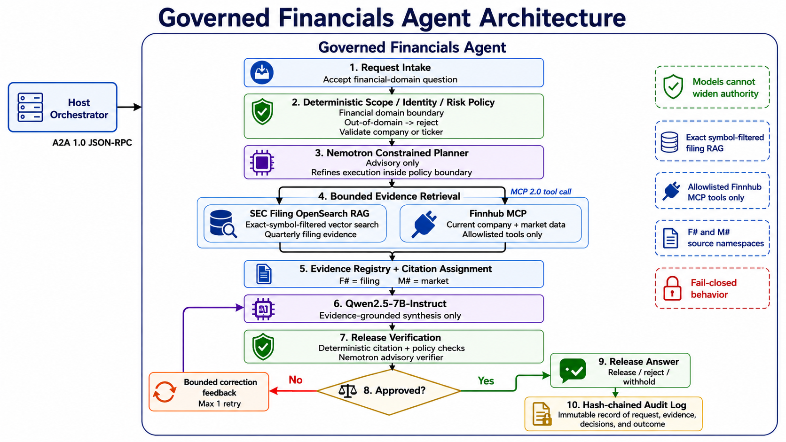
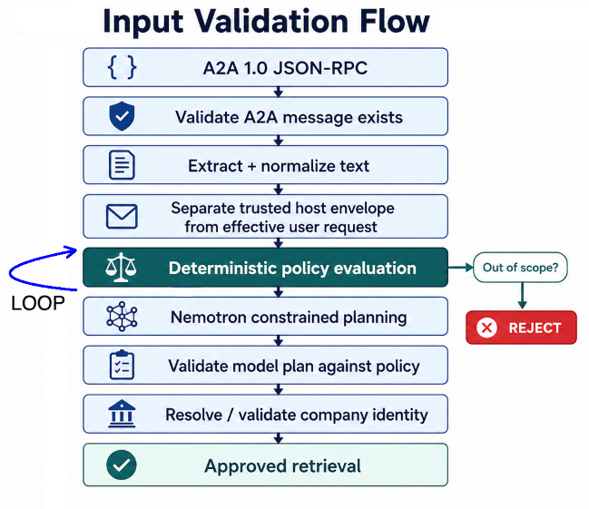
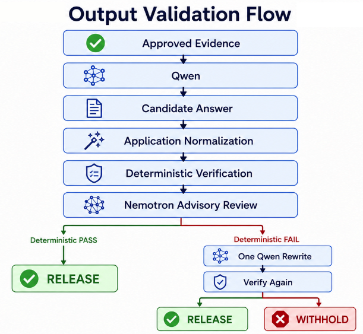

# Episode 3: Financials Expert

A financial answer can contain accurate numbers and still be misleading. The numbers might belong to another company, describe a different reporting period, or be presented as a current stock price when they came from an older document. A useful expert needs boundaries around both the information it retrieves and the conclusions it releases.

In this episode, you run the **Financial Expert**, the financial-domain application in the lab's **application-level Mixture of Experts (MoE)** architecture. It combines SEC filing passages already stored in OpenSearch with current market information obtained from Finnhub through MCP.

> **IMPORTANT:** Its job is to explain available financial evidence, not provide personalized investment recommendations.

You will inspect the preloaded filings, test both data paths independently, ask financial questions, and examine input validation, output checks, and hash-linked audit records. This supplies the financial side of technology-company research: what the available filings report and what the market-data provider returns now.

## What you will learn

[Episode 2](../2-news-agent/README.md) introduced vector retrieval, MCP, separate planning and generation roles, and bounded correction. This episode builds on those concepts rather than repeating them. The additional focus is **issuer identity, financial reporting periods, quote timestamps, and the distinction between a valid citation and a verified financial claim**.

| Step | Activity | Checkpoint |
|---|---|---|
| 1 | Enter the development container and inspect configuration. | The Financial Expert's source, models, and service addresses are identified. |
| 2 | Inspect the preloaded SEC corpus. | Available symbols, filing metadata, and date coverage are visible. |
| 3 | Retrieve filing passages directly. | Every returned passage belongs to the selected symbol. |
| 4 | Start and test Finnhub through MCP. | The quote tool returns structured fields and timestamps, or a diagnosable error. |
| 5 | Start the Financial Expert. | Its health endpoint and Agent Card respond. |
| 6 | Ask filing-only, quote-only, and combined questions. | The chosen sources and `F#` / `M#` citations can be inspected. |
| 7 | Exercise input / output governance. | Scope, identity, source selection, and risk classification are distinguishable. |

## Understand the Financial Expert before starting it

The expert has two financial evidence paths:

| Evidence path | Responsibility | Citation namespace |
|---|---|---|
| SEC filing RAG in OpenSearch | Retrieve passages from the stored filings for the requested issuer. | `F1`, `F2`, etc |
| Finnhub through MCP | Obtain real-time structured company identity, quote, metrics, and earnings data through the implemented tools. | `M1`, `M2`, etc |

A filing passage can support a statement about reported revenue. It cannot establish the current trading price. A quote can supply a market observation, but it does not replace the explanation and reporting context in a filing. **The source must be appropriate for the claim, not merely relevant to the company.**



The shared Agentic RAG pattern is described in [Episode 2](../2-news-agent/README.md#why-this-is-agentic-rag) in the [Why this is Agentic RAG](../2-news-agent/README.md#why-this-is-agentic-rag) section. Here, deterministic code first selects permitted source categories and extracts company identity. The internal planner can refine that plan within its boundaries. The application gathers evidence, requests a candidate answer, checks it, and allows one correction before release or withholding. When both source categories are selected, filing retrieval and the market-tool batch run concurrently.

The `ORCH` settings name the **planning and advisory-verification model inside this expert**. The `LLM` settings name its answer-generation model. The source retains Nemotron and Qwen names for these roles, but the effective provider and model come from configuration. See [Episode 2's model-role explanation](../2-news-agent/README.md#why-use-separate-planning-and-generation-models) for that separation.

[Implementation: execution workflow](src/financials_agent/financials_agent.py)
[Planning boundaries](src/financials_agent/planner.py)
[Model configuration](src/common/config.py)

## Before you begin

Complete Episode 1's environment and model validation. The existing Compose environment must contain the `lab`, `opensearch`, and `dashboards` services. You also need a [Finnhub API key](https://finnhub.io/) for the market-data exercises. The development container already contains the Python environment and dependencies.

Finnhub receives the company/symbol and other arguments for the selected tools, rather than the entire financial question.

## Step 1: enter the existing workspace

Open three **host terminal windows**. In each, enter the existing development container:

```bash
podman compose exec lab bash
```

Run this from the host directory containing the Compose file. When the environment was started with Podman, use `podman compose exec lab bash` instead. Keep using the engine selected in Episode 1.

In each **container shell**, locate and enter the Financial Expert directory:

```bash
cd /workspace/agentic-rag/3-financials-agent
pwd
```

Use these names for the three new terminals:

| Terminal | Purpose |
|---|---|
| **A** | Run the Finnhub MCP server in the foreground. |
| **B** | Run the Financial Expert in the foreground. |
| **C** | Inspect data, send questions, and examine governance and audits. |

These are three shells in one development container. An environment export in one shell does not change the others or an already-running process.

### Check addresses and effective settings

| Component | Address inside `lab` | Access from the host |
|---|---|---|
| OpenSearch | `http://opensearch-single:9200` | `http://localhost:9200` |
| OpenSearch Dashboards | `http://opensearch-single-dashboards:5601` | `http://localhost:5601` |
| Finnhub MCP | `http://127.0.0.1:8766/mcp` | Not published by the supplied Compose file. |
| Financial Expert | `http://127.0.0.1:9002` | Not published by the supplied Compose file. |

Keep all expert and MCP probes inside `lab`. OpenSearch is in a different container, so `localhost:9200` is not its address from these shells.

**Terminal C:**

```bash
python - <<'PY'
from src.common.config import load_settings

s = load_settings()
for label, value in (
    ("OpenSearch", f"{s.opensearch_host}:{s.opensearch_port}"),
    ("Filing index", s.opensearch_index),
    ("Embedding model", s.embedding_model),
    ("Filing top_k", s.rag_top_k),
    ("Filing candidates", s.rag_num_candidates),
    ("Planner/verifier model", s.orch_model),
    ("Generator model", s.llm_model),
    ("Finnhub MCP", s.financials_mcp_url),
    ("Finnhub key present in this shell", bool(s.finnhub_api_key)),
    ("Financial Expert", s.financials_agent_url),
    ("Policy checks", s.policy_checks_enabled),
    ("Evidence checks", s.evidence_checks_enabled),
    ("Release checks", s.release_checks_enabled),
    ("Audit path", s.audit_log_path),
):
    print(f"{label}: {value}")
PY
```

**Expected:** OpenSearch is `opensearch-single:9200`; the index is `financial-filings-vector-chunks`; `top_k` and candidates are both `3`; all three check categories are `True`; the audit path defaults to `./logs/financials-audit.jsonl`. The embedding default is `Qwen/Qwen3-Embedding-0.6B`. Model identifiers should match the profile validated in Episode 1.

This command prints selected settings, not credentials. Avoid publishing a full environment dump, `docker inspect`, or expanded Compose configuration.

## Step 2: inspect the preloaded SEC corpus

Before asking about a company's financials, check whether the corpus contains that issuer and the relevant reporting period. A populated index is not proof that every company or quarter is represented.

**Terminal C:**

```bash
python - <<'PY'
import json
from src.common.config import load_settings
from src.common.opensearch_client import create_client

s = load_settings()
client = create_client(s)
try:
    count = client.count(index=s.opensearch_index)["count"]
    print(f"Index: {s.opensearch_index}; indexed chunks: {count}")
    if count == 0:
        raise SystemExit("The preloaded filing index is empty. Stop before retrieval.")

    mapping = client.indices.get_mapping(index=s.opensearch_index)
    properties = mapping[s.opensearch_index]["mappings"]["properties"]
    print("Relevant mapping:")
    print(json.dumps({
        field: properties.get(field)
        for field in ("symbol", "filing_date", "embedding")
    }, indent=2))

    result = client.search(index=s.opensearch_index, body={
        "size": 3,
        "_source": ["path", "title", "company", "symbol", "filing_type",
                    "filing_date", "fiscal_period", "accession_number",
                    "source_url", "chunk_index", "text"],
        "aggs": {
            "issuers": {
                "terms": {"field": "symbol", "size": 50},
                "aggs": {
                    "earliest_filing_date": {
                        "min": {"field": "filing_date", "format": "yyyy-MM-dd"}
                    },
                    "latest_filing_date": {
                        "max": {"field": "filing_date", "format": "yyyy-MM-dd"}
                    },
                    "missing_filing_date": {"missing": {"field": "filing_date"}},
                },
            },
        },
    })
    print("Issuer coverage, up to 50 symbol buckets:")
    print(json.dumps(result["aggregations"], indent=2))
    print("Sample chunks:")
    for hit in result["hits"]["hits"]:
        record = dict(hit["_source"])
        record["chunk_id"] = hit["_id"]
        record["text"] = record.get("text", "")[:500]
        print(json.dumps(record, indent=2, ensure_ascii=False))
finally:
    client.close()
PY
```

**Expected:** a positive chunk count, a `keyword` mapping for `symbol`, and a `knn_vector` embedding field using Lucene HNSW and cosine similarity. Inspect the actual dimension rather than assuming one. The aggregation shows available symbols and their dated coverage. Bucket counts count **chunks**, not distinct filings.

The latest `filing_date` present is not proof of complete coverage through that date, and `fiscal_period` describes a reporting period rather than when the document was filed. Some records may omit either field. Do not convert a date in a filename into a verified filing date or a hard corpus cutoff. The supplied source archive does not include the actual filing dataset or an image-build manifest establishing that cutoff.

For a graphical check, open `http://localhost:5601` in the **host browser** and use **Dev Tools** to inspect `financial-filings-vector-chunks`. It is the same index, not another evidence source.

### What is different about SEC ingestion?

The chunk-size tradeoffs are already covered in [Episode 2: What ingestion already did](../2-news-agent/README.md#what-ingestion-already-did). The current Financial Expert command uses the same **2,048-character chunks**, **256-character overlap**, and **16-item embedding batches**. The financial-specific differences are:

| Detail | Current Financial Expert behavior | Why it matters |
|---|---|---|
| Input files | Recursively discovers `.md` filings under `./quarterly_filings`. | These are text-converted filings, not the article CSV format. No conversion or ingestion is required here. |
| Issuer identity | Uses sidecar `symbol`/`ticker` first, then a filename prefix such as `aapl-...`, then a suitable parent directory. | Each chunk carries the issuer label used to isolate retrieval. |
| Filing metadata | Preserves form type, filing date, fiscal period, accession number, source URL, path, and chunk index when supplied. | A financial figure needs document and period context, not only a similarity score. |
| Embedding input | Embeds the original chunk text; metadata remains in separate indexed fields. | The issuer boundary is an explicit filter, not a request for the embedding model to infer identity. |
| Traceability | Uses a path/chunk-based document ID and stores a SHA-256 digest of each original chunk. | Retrieved passages can be associated with their source location and content digest. |

[Implementation: filing discovery, sidecars, and chunking](src/ingest.py)
[Index mapping](src/common/opensearch_client.py)

## Step 3: retrieve filing evidence without generating an answer

Let's call the repository's filing retriever directly:

```bash
python - <<'PY'
import asyncio
import json
import os
from src.common.config import load_settings
from src.financials_agent.retrieval import FinancialFilingsRAG

async def main():
    symbol = "AAPL"
    items, trace = await FinancialFilingsRAG(load_settings()).retrieve(
        f"What do the available SEC filings report about {symbol} revenue?",
        symbol,
    )
    print(json.dumps(trace.to_dict(), indent=2))
    if trace.error:
        raise SystemExit(f"Filing retrieval failed: {trace.error}")
    if not items:
        raise SystemExit("No matching filing chunks. Recheck issuer coverage.")
    for item in items:
        if item.metadata.get("symbol") != symbol:
            raise SystemExit("Unexpected issuer in returned evidence. Stop here.")
        print(f"\n[{item.evidence_id}] {item.title}")
        print(f"As of: {item.as_of or 'not supplied'}")
        print(json.dumps(item.metadata, indent=2))
        print(item.content)

asyncio.run(main())
PY
```

**Expected:** up to three evidence items, labeled `F1`, `F2`, and `F3`, with a trace containing `symbol_filter`, `hit_count`, path/chunk locators, and scores. This direct probe does not call the planning or generation model, invoke Finnhub, or append an expert-request audit record.

The first retrieval still loads the local embedding model and may download its files. Preloaded document vectors do not eliminate the need to embed a new question. Keep the same embedding model as the preloaded corpus; refer to [Episode 2's retrieval explanation](../2-news-agent/README.md#how-vector-retrieval-works-here) for the shared vector concepts.

### Why an exact symbol filter matters

The k-NN query includes an exact term filter equivalent to:

```json
{"term": {"symbol": "AAPL"}}
```

The selected symbol changes with the question. The filter is inside the vector-search request, not a suggestion in the generation prompt. Semantically similar revenue passages from other issuers are outside the eligible set. This is an example of governance implemented **before evidence reaches the model**.

The filter still depends on correct ingestion labels. It does not independently authenticate the original document. It also does not select a fiscal period: this implementation has no automatic latest-filing sort or reporting-period filter. A request for the "latest" financial result can only be answered within the evidence actually returned.

Financial retrieval uses `RAG_TOP_K=3` and `RAG_NUM_CANDIDATES=3`. Its query builder differs from the one discussed in Episode 2: a larger candidate value adds a `rescore.oversample_factor`; it is not sent as the same query-level `ef_search` parameter. No per-document diversity cap or minimum similarity-score gate is implemented here. A nearest neighbor can still be insufficient evidence.

**Troubleshooting:** a dimension error requires checking the query embedding configuration against the stored mapping, not deleting the index. Zero hits require checking the exact symbol and corpus coverage. Irrelevant hits require reading the source text and narrowing the question, not assuming the score establishes correctness.

[Implementation: financial retriever](src/financials_agent/retrieval.py)
[Filtered query construction](src/common/opensearch_client.py)

## Step 4: start and test Finnhub through MCP

### Why the financial expert needs current market data

The SEC corpus is a snapshot. It cannot contain information published after its collection cutoff or a stock quote observed after those filings were ingested. Asking the generator to supply that missing information from memory would break the evidence boundary.

Finnhub provides the implemented path for data points beyond that snapshot. For a current-price question, the application calls `get_stock_quote(symbol=...)` through the local MCP server, which calls Finnhub's `/quote` endpoint. It does not retrieve an old filing and ask the generator to estimate today's price.

This is an **on-demand quote request**, not a continuous price feed. MCP's Streamable HTTP transport describes how the tool is called; it does not mean this application subscribes to a market-data stream. "Current" means the latest quote returned by the provider, with its recorded timestamp, not a guarantee that the observation was made this second.

The MCP boundary is the same concept introduced in [Episode 2](../2-news-agent/README.md#step-4-start-and-test-tavily-through-mcp). Here the server exposes six financial tools, and the planner's allowlist constrains which names enter the normal execution plan:

| Tool | Purpose |
|---|---|
| `resolve_public_symbol` | Look for a matching public-company symbol and confirm the issuer through profile data. |
| `get_company_profile` | Return company identity, exchange, currency, and profile fields. |
| `get_stock_quote` | Return the current price, change, daily range, previous close, and market timestamp. |
| `get_company_metrics` | Return the implemented valuation, profitability, growth, and leverage fields. |
| `get_recent_quarterly_earnings` | Return a bounded set of reported/estimated EPS observations. |
| `get_earnings_calendar` | Return earnings-calendar entries for a date range. |

These are data-retrieval tools. There is no order-placement tool, arbitrary REST tool, or general browsing tool in this server. Tool arguments are constructed by application code; the answer generator does not choose arbitrary URLs or execute trades.

[Implementation: MCP server](src/financials_agent/finnhub_server.py) 
[Finnhub adapter and typed results](src/financials_agent/finnhub.py)
[Plan allowlist](src/financials_agent/planner.py)

### Start the MCP server

**Terminal A**, with the Finnhub API key inherited from Compose or supplied in that shell:

```bash
make mcp
```

**Expected:** the Streamable HTTP server starts at `http://127.0.0.1:8766/mcp`. Keep it running. Startup alone does not validate the API key; the provider is contacted when a tool runs.

### Call the same MCP adapter used by the expert

**Terminal C:**

```bash
python - <<'PY'
import asyncio
import json
import os
from src.common.config import load_settings
from src.financials_agent.mcp_client import FinancialMCPClient

async def main():
    symbol = "AAPL"
    traces = await FinancialMCPClient(load_settings()).call_tools([
        ("get_stock_quote", {"symbol": symbol}),
    ])
    for trace in traces:
        print(f"Tool: {trace.tool}; ok: {trace.ok}; latency: {trace.latency_ms:.1f} ms")
        if not trace.ok:
            raise SystemExit(trace.error)
        print(json.dumps(trace.data, indent=2, ensure_ascii=False))

asyncio.run(main())
PY
```

**Expected:** a structured quote result containing fields such as `symbol`, `current_price`, `previous_close`, `market_timestamp`, and `retrieved_at`. The adapter can accept an MCP result wrapper, so some versions may nest that object under `result`. This probe uses Finnhub but does not invoke a language model, assign `M#` citations, or write an expert-request audit.

### Read the two timestamps, not only the price

`market_timestamp` comes from the provider's quote timestamp and is converted to UTC. `retrieved_at` records when the adapter obtained the response. A recent retrieval time does not make an older quote a new observation. For quote evidence, the expert prefers `market_timestamp` for its `as_of` value and falls back to retrieval time when it is absent.

Check for missing/null prices, zero-filled results, an empty market timestamp, or a `publicly_traded` value of `False`. That quote flag is derived from whether quote fields contain values; it is not the same as the resolver's issuer verification. The implementation has **no hard maximum quote-age check**, and a structured response alone does not prove a usable current quote. Inspect and disclose these limits rather than replacing missing values with guesses.

**Troubleshooting:** connection refusal means checking Terminal A and `FINANCIALS_MCP_URL`. Missing-key or HTTP authorization errors require fixing the server's credentials and restarting it. For rate limits or unavailable endpoints, check the provider response and account access rather than repeatedly issuing requests. A raw GET to `/mcp` is not a substitute for this protocol-aware probe.

[Implementation: MCP result handling](src/financials_agent/mcp_client.py)
[Quote fields and timestamps](src/financials_agent/finnhub.py)
[Market evidence construction](src/financials_agent/financials_agent.py)

## Step 5: start the Financial Expert

**Terminal B:**

```bash
make agent
```

Keep it running. In **Terminal C**, check the service and its advertised contract:

```bash
curl --fail --silent --show-error \
  http://127.0.0.1:9002/health | python -m json.tool

curl --fail --silent --show-error \
  http://127.0.0.1:9002/.well-known/agent-card.json | python -m json.tool
```

**Expected:** health reports `status: "ok"`, the filing index, Finnhub MCP URL, and configured model names. The Agent Card identifies `Financial Agent`, the `financial_search` skill, and one JSON-RPC interface using protocol version `1.0`. Its JSON-RPC endpoint is `/` on port `9002`.

Health reports server/configuration state; it does not probe Finnhub, OpenSearch, or the model provider. Passing health is therefore not a replacement for Steps 3 and 4 or an end-to-end request.

[Implementation: server and health](src/financials_agent/__main__.py)
[Direct A2A client](src/query.py)

## Step 6: ask the Financial Expert questions

Run these sequentially in **Terminal C**, keeping `LAB_SYMBOL` set to the issuer selected earlier. The Makefile's `client` and `query` targets both run `python -m src.query`. Wording, provider data, latency, and model responses vary; the prompts are exercises, not fixed answer keys.

### Current quote only

```bash
make client QUESTION="What is AAPL current stock price? Include the quote timestamp."
```

**Observe:** the deterministic plan selects market data and includes `get_stock_quote`. It does not select filing retrieval. An explicit ticker avoids a company-name lookup, and a quote-only request does not initialize the filing retriever's embedding model or OpenSearch client. The constrained planner may add other allowlisted market tools, but cannot add the filing source category to this baseline.

A supported quote should carry an `M#` citation. Check the price and timestamp against the tool result, not against a value printed in this README.

### Available filings only

```bash
make client QUESTION="Summarize AAPL revenue from the available SEC filings. State the reporting periods and units supported by the passages."
```

**Observe:** this wording selects filings, with no market-data category. Because a ticker was supplied, no Finnhub lookup is needed. Supported statements should cite `F#` evidence and stay within the periods in the retrieved passages.

This intentionally avoids words such as "quarterly earnings," which also select Finnhub earnings tools under the current phrase rules. An instruction to use filings is not a separate API flag that overrides those rules.

### Quarterly performance and current price

```bash
make client QUESTION="Describe AAPL recent quarterly financial performance and its current stock price. Separate reporting periods from the quote timestamp and state missing evidence."
```

**Observe:** this wording selects both source categories. The baseline includes `get_recent_quarterly_earnings` and `get_stock_quote`. Filing retrieval and the market-tool batch run concurrently; individual tools within that batch run sequentially.

When both paths return useful evidence and the answer uses both, expect `F#` and `M#` citations. Do not require the financial statements and quote to share an observation date. Instead, distinguish their dates and explain what each supports.

**Partial results are possible.** With evidence checks enabled, the workflow requires some requested financial evidence beyond symbol resolution. It does not require every requested tool or source category to succeed. A partial answer can be released when the implemented checks pass. Inspect the audit and the answer's evidence limits before treating it as a complete response.

### Understand the answer contract

A released answer is intended to have this shape. The placeholders below are an illustration, not financial data:

```text
## Financial assessment
<Financial statement supported by the retrieved filing passage.> [F1]
<Quote and its observation time from the provider result.> [M1]

## Evidence limits
<Missing periods, unavailable tools, stale observations, or incomplete passages.>

## Sources
- [F1] <Filing source, title, available date, and source URL when supplied>
- [M1] <Finnhub tool name, available timestamp, and provider URL>

Audit ID: <server-assigned identifier>
```

The application constructs Sources from the registered evidence IDs cited by the generator and adds its own Audit ID. It does not invent a citation to repair an unsupported claim. Filing path/chunk details are retained in evidence metadata and the audit; they are not necessarily printed in the Sources section.

[Implementation: source selection](src/financials_agent/planner.py)
[Execution and evidence numbering](src/financials_agent/financials_agent.py) 
[Answer contract](src/financials_agent/prompts.py)
[Source rendering](src/financials_agent/governance.py)

## Step 7: inspect input / output governance

While we didn't cover the input / output governance with the News Expert, this applies to both the Financials and News Experts.

### Inspect the input governance

A domain prompt is not an input boundary. The application must decide what work is permitted before giving a model or tool the opportunity to perform it. For this expert, the relevant boundaries are **financial scope, issuer identity, permitted source categories, and permitted tool names**.



Inspect the deterministic plan locally, without contacting external services. **Terminal C:**

```bash
python - <<'PY'
import json
from src.financials_agent.planner import deterministic_plan

questions = [
    "What is AAPL current stock price?",
    "Summarize AAPL revenue from the available SEC filings.",
    "Describe AAPL recent quarterly financial performance and its current stock price.",
    "What is the weather tomorrow?",
    "What is the current stock price?",
    "For ticker: AAPL, should I buy stock for my portfolio?",
]
for question in questions:
    print(f"\nQuestion: {question}")
    print(json.dumps(deterministic_plan(question).to_dict(), indent=2))
PY
```

**Observe:** the quote, filing, and combined questions select different source categories. The weather question has `in_scope: false`. The identity-free price question has no symbol or company. The advice question receives `risk: "high"`.

That last distinction matters: **high risk is a classification, not an automatic input rejection in this implementation**. The workflow does not branch on that flag to block retrieval or generation. Its no-advice instruction and implemented output patterns operate later. Similarly, phrase-based scope rules are not a complete intent classifier, and ticker parsing is not a full security-master service.

The advice example deliberately uses `ticker: AAPL`. In this source revision, an unqualified uppercase token such as the pronoun `I` can otherwise be captured as a ticker. Inspect the plan's `symbol` rather than assuming issuer extraction succeeded.

[Implementation: input parsing and constrained plans](src/financials_agent/planner.py)
[Input exits and resolution](src/financials_agent/financials_agent.py)
[Issuer matching](src/financials_agent/finnhub.py)

### Inspect the output governance

The generator is asked to use approved evidence, cite financial claims, disclose limits, and avoid unsupported forecasts or recommendations. Those instructions describe desired behavior. Deterministic checks define which parts the application actually enforces.



Keep all three check categories enabled:

| Setting | What the current implementation checks |
|---|---|
| `POLICY_CHECKS_ENABLED=true` | Financial-domain rejection and constrained planning, plus implemented output patterns for investment advice and cross-domain leakage. |
| `EVIDENCE_CHECKS_ENABLED=true` | Availability of requested financial evidence, duplicate/wrongly namespaced evidence IDs, recognized unknown `F#`/`M#` citations, presence of valid citations, and citation-to-Sources consistency. |
| `RELEASE_CHECKS_ENABLED=true` | Required financial-assessment heading, assigned Audit ID, and invocation of the advisory model verifier. |

Before verification, the application can move a citation-only line onto the preceding claim, rebuild `## Sources` from existing citations, and replace a model-written Audit ID. This normalizes formatting; it does not establish that a number agrees with its source.

### Test the hard checks with synthetic data

The following uses the repository's normalization and verification helpers with **invented test evidence**. It calls no provider, changes no service settings, and writes no audit record. It is more repeatable than hoping a live model will produce a particular invalid answer.

**Terminal C:**

```bash
python - <<'PY'
from dataclasses import replace
from src.financials_agent.governance import normalize_generated_answer, verify_answer
from src.financials_agent.models import Evidence

item = Evidence(
    evidence_id="M1",
    kind="market_data",
    source="Synthetic local test fixture",
    title="Invented quote, not a real security",
    content='{"current_price": 100.0}',
    as_of="synthetic fixture; not live data",
)
body = (
    "## Financial assessment\n"
    "Synthetic quote: 100.0. [M1]\n\n"
    "## Evidence limits\n"
    "Invented data for a local validation exercise."
)
cases = [
    ("Valid structure and citation", body, [item], True),
    ("Unknown citation", body.replace("[M1]", "[M99]"), [item], False),
    ("No citation", body.replace("[M1]", ""), [item], False),
    ("Wrong evidence namespace", body.replace("[M1]", "[F1]"),
     [replace(item, evidence_id="F1")], False),
    ("Prohibited recommendation",
     body.replace("Synthetic quote:", "You should buy this stock. Synthetic quote:"),
     [item], False),
    ("Missing required heading",
     body.replace("## Financial assessment", "## Summary"), [item], False),
    ("Wrong number but valid citation", body.replace("100.0", "999.0"), [item], True),
]
audit_id = "local-validation-exercise"
for label, candidate, evidence, expected in cases:
    normalized = normalize_generated_answer(candidate, audit_id, evidence)
    result = verify_answer(normalized, evidence, audit_id)
    print(f"\n{label}: approved={result.approved}")
    for reason in result.reasons:
        print(f"  {reason}")
    if result.approved != expected:
        raise SystemExit(f"Unexpected result for {label}; inspect the current verifier.")
PY
```

**Expected:** the valid example passes. The missing/unknown citation, wrong namespace, prohibited recommendation, and missing-heading examples fail. The deliberately incorrect number **also passes deterministic verification**, because those checks do not compare each number with the evidence body.

That final case is a boundary to understand, not a successful financial answer. A registered citation establishes a connection to an approved source item. It does not prove that the cited item supports the sentence.

### Where the advisory verifier fits

The model reviewer can flag unsupported claims, contradictions, and other evidence problems. In the current code, its verdict is **advisory**: a rejection, malformed verdict, or unavailable reviewer does not independently veto a deterministic pass. The shared advisory behavior was introduced in Episode 2; inspect `model_checked` and `model_approved` separately from `approved` when reviewing this expert's audit.

A failed deterministic check triggers one correction using the same evidence and recorded reasons. A second failure produces `withheld_by_verifier`. There is no open-ended retry loop and no guarantee that rewriting repairs missing evidence.

Other limits follow from the implementation: `## Evidence limits` is requested in the prompt but is not a required-heading hard check; there is no exhaustive claim-by-claim citation or arithmetic check; investment-language matching covers specific patterns rather than every possible recommendation; and partial-source coverage or an old quote is not automatically a release failure. **Use the checks as inspectable controls, not as proof of financial correctness or regulatory compliance.**

[Implementation: normalization and deterministic checks](src/financials_agent/governance.py)
[Generation and review instructions](src/financials_agent/prompts.py)
[Correction and withholding](src/financials_agent/financials_agent.py)

## Completion checkpoint

You have completed this episode! Leave the shared services running in Terminals A (Finnhub MCP) and B (Financials Expert) when continuing the workshop.

The financial-specific lessons are:

- **match the issuer before retrieving**
- **preserve reporting periods and observation times**
- **distinguish citation validity from claim correctness**, and
- **verify audit persistence rather than inferring it from an answer.**

These are responsibilities of the application around the model, not features gained by assigning the model a financial persona.

Continue to [Episode 4: Orchestrator Expert](../4-orchestrator-agent/README.md), or return to the [workshop episode index](../README.md).

## Troubleshooting reference

| Symptom | Check and next action |
|---|---|
| Financial module cannot be found | Re-enter the expert directory in Step 1. Run Make targets from the directory containing its `Makefile`, not the repository root. |
| `opensearch-single` does not resolve | Run the command inside `lab` on the existing Compose network. |
| Filing index is missing or empty | Verify the preloaded image, configured index, and OpenSearch startup logs. Do not recreate or ingest over it. |
| Wrong issuer, irrelevant passage, or missing period | Inspect stored `symbol`, path, text, and period metadata. The filter cannot repair incorrect ingestion labels or absent evidence. |
| Embedding model load or vector-dimension error | Check cache access, memory, and embedding compatibility. Do not substitute a different embedding model or delete vectors. |
| Finnhub MCP starts but quotes fail | Test the adapter, not only startup. Check the key in Terminal A, provider authorization/quota, and its error logs. |
| Quote timestamp is old or price fields are absent | Treat the result as limited evidence. The code has no hard freshness threshold; do not relabel retrieval time as market time. |
| Port `8766` or `9002` is occupied | Reuse or stop the earlier foreground process before starting another. |
| Health passes but expert requests fail | Health does not probe dependencies. Use the direct retrieval/MCP checks and the validated Episode 1 model profile. |
| Model provider rejects parameters or token budget | Inspect Terminal B and the effective model settings. Restore the validated profile rather than disabling governance or upgrading dependencies during the lab. |
| Direct query times out during a slow request | The client uses a 120-second HTTP timeout; model loading/calls can take longer. Check Terminal B for completion and the audit before submitting another request. |
| No quote after a company-name request | Inspect symbol-resolution evidence. A failed lookup is not permission to substitute a similarly named issuer. |
| A2A reports completion but the answer is withheld | Inspect `outcome`, final verification reasons, warnings, and source availability. Task completion is not release approval. |
| `make audit` cannot find the file | Direct probes do not create it. Check the server's configured path; the Make target always uses `./logs/financials-audit.jsonl`. |
| Audit chain fails or the latest answer has no record | Preserve the file and inspect Terminal B for append errors, permissions, disk space, or corruption. Do not edit/re-hash the active log to make it pass. |
| `make test` reports no tests | A Make target exists, but the supplied source archive contains no financial test suite. This walkthrough uses the local governance checks above and does not require test installation. |
