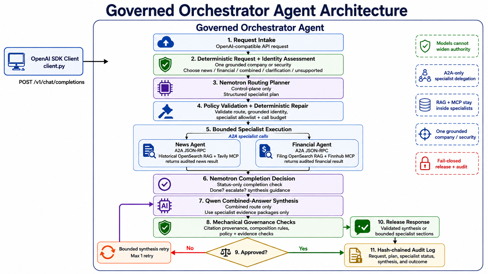
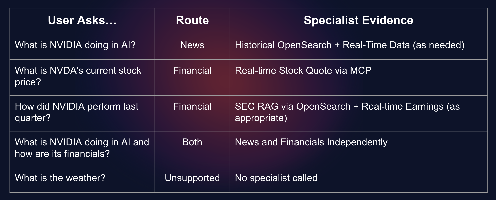
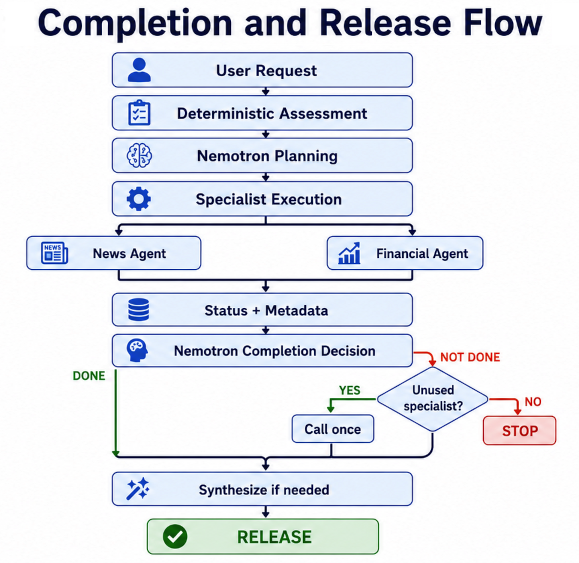

# Episode 4: Orchestrator Expert

A research question can cross more than one domain. Understanding what a technology company is building requires different evidence from understanding its reported financial results. Combining those answers should not erase who supplied each fact, which rules applied, or what the evidence could not establish.

In this episode, you run the **Orchestrator Expert**, the coordination layer in this lab's **Mixture of Experts (MoE)** architecture. It determines which expert should participate, delegates through Agent2Agent (A2A), evaluates whether the bounded workflow should continue, and coordinates the final response. The important take away, it does not contribute to the final composed answer to the client.

The research goal is to connect technology developments with financial observations while preserving their evidence boundaries. An announcement and a stock quote can appear in the same answer. Their coexistence does not prove that the announcement caused the price. The Orchestrator must preserve that distinction when it combines independently produced results.

> **IMPORTANT:** This is a demonstration of bounded orchestration and inspectable governance, not a production authorization, compliance, investment-advice, or trading system.

## What you will learn

The preceding episodes established the independently governed experts. Here, the focus shifts from **how an expert answers** to **how several experts cooperate without losing their responsibilities**.

| Step | Activity | Checkpoint |
|---|---|---|
| 1 | Enter the existing development container and inspect effective settings. | The Orchestrator's source, model roles, service addresses, and limits are identified. |
| 2 | Inspect the existing A2A delegation boundary. | Both configured expert interfaces are discoverable from the Orchestrator's container. |
| 3 | Inspect deterministic routing and company continuity. | Domain ownership, identity ambiguity, and current-turn routing are distinguishable. |
| 4 | Examine the bounded orchestration loop. | Completion, additional delegation, retries, and stopping conditions are understood. |
| 5 | Test synthesis and release boundaries with synthetic evidence. | Citation provenance is distinguishable from claim correctness. |
| 6 | Start the Orchestrator and check its HTTP input contract. | The service responds without invoking a model or expert. |

The local exercises inspect application code and use synthetic fixtures where needed. They do not introduce a conversation application. End-to-end interaction belongs to Episode 5.

## Understand the Mixture of Experts before starting it

### Experts need boundaries, not only different prompts

In this lab, **MoE means routing work among separately governed agent applications**. An expert's specialization comes from its domain contract, approved evidence access, generation instructions, verification rules, and audit behavior.

Putting every tool and every document into one general-purpose prompt would leave that prompt responsible for deciding which authority applies. This architecture instead makes those responsibilities explicit in each domain expert. An expert can produce a result or explain an evidence limitation without another component silently replacing that limitation with a guess.

The Orchestrator supplies the coordination needed to make those boundaries useful together. We have previously mentioned that the **harness**, controls request assessment, permitted delegates, model-output schemas, retries, response composition, and audit persistence. The model proposes actions within that harness.

### The Orchestrator is a control plane, not a knowledge base

The Orchestrator needs to determine **what is being requested, which expert owns the work, whether further delegation is permitted, and what can be released**. It does not need a second copy of the domain corpus.



The Orchestrator has no direct OpenSearch, MCP, web-search, or market-data retrieval path. Shared environment variables do not change that execution path. When information is missing, it must work with an expert's result or limitation rather than query the underlying provider itself.

This is an application boundary, not a security sandbox. The lab runs these processes in the same development container and supplies shared environment settings. The separation demonstrated here does not establish process isolation or per-expert credential isolation.

[Implementation: runtime construction and execution](src/host_agent/routing_agent.py)

### Separate control decisions from answer composition

| Responsibility | Implementation role | Information supplied |
|---|---|---|
| Assess scope and company identity | Deterministic policy code | The current request and bounded identity signals from earlier turns. |
| Propose a route | `ORCH` planning model | The current user request, deterministic assessment, fixed specialist registry, and limits. |
| Decide whether to finish | `ORCH` completion model | The request and status metadata, including whether output exists, citation/warning counts, and unused experts. |
| Compose a combined answer | `LLM` synthesis model | The user request, synthesis guidance, and participating experts' response packages. |
| Check and release | Deterministic application code | The plan, response envelopes, recognized citations, check results, and audit-write outcome. |

The source names the control model **Nemotron** and the synthesis model **Qwen**. These names identify the original model roles, not a requirement that those exact models are active. Configuration can select external models, including the same provider/model for both roles. The responsibilities remain separate even when the model identifier is the same.

The completion model does **not** receive expert response prose or retrieved passages. It receives status metadata. The synthesis model receives the response packages, but is instructed not to contribute facts from its own memory. This keeps the planning decision separate from domain answer generation.

[Implementation: model prompts and payload construction](src/host_agent/llm_client.py)

## Before you begin

Complete Episode 1's environment and model validation. Leave the services established in [Episode 2](../2-news-agent/README.md) and [Episode 3](../3-financials-agent/README.md) running.

The existing Compose environment must contain the `lab`, `opensearch`, and `dashboards` services.

## Step 1: enter the existing workspace

Open two additional **host terminals**. From the host directory containing the Compose file, enter the existing development container in each:

```bash
podman compose exec lab bash
```

When the environment was started with Podman, use `podman compose exec lab bash` instead. Keep using the engine selected in Episode 1.

In both **container shells**, enter the episode directory:

```bash
cd /workspace/agentic-rag/4-orchestrator-agent
pwd
```

| Terminal | Purpose |
|---|---|
| **Orchestrator** | Run the Orchestrator service in the foreground. |
| **Inspection** | Inspect configuration and contracts, run local exercises, and examine audits. |

These are two shells in the same container. An export in one shell does not modify another shell or an already-running process.

### Inspect the settings the application will actually use

Run this in **both terminals** before starting the service:

```bash
python - <<'PY'
from pathlib import Path
from src.host_agent.config import load_settings

s = load_settings()
for label, value in (
    ("Bind address", f"{s.api_host}:{s.api_port}"),
    ("Planning/completion endpoint", s.orch_url),
    ("Planning/completion model", s.orch_model),
    ("Planning token limit", s.orch_max_tokens),
    ("Synthesis endpoint", s.llm_url),
    ("Synthesis model", s.llm_model),
    ("Synthesis token limit", s.llm_max_tokens),
    ("News A2A base URL", s.news_agent_url),
    ("Financial A2A base URL", s.financial_agent_url),
    ("A2A timeout, seconds", s.a2a_timeout_seconds),
    ("Policy checks", s.policy_checks_enabled),
    ("Evidence checks", s.evidence_checks_enabled),
    ("Release checks", s.release_checks_enabled),
    ("Audit path", Path(s.audit_log_path).resolve()),
    ("Raw query auditing", s.audit_include_query),
    ("Orchestration rounds", s.max_orchestration_rounds),
    ("Specialist-call limit", s.max_specialist_calls),
    ("Clarification limit", s.max_clarifications),
    ("Planner retries after first attempt", s.planner_retries),
):
    print(f"{label}: {value}")
if not all((s.policy_checks_enabled, s.evidence_checks_enabled,
            s.release_checks_enabled)):
    raise SystemExit("Restore all three governance checks before continuing.")
PY
```

**Expected:** the default bind address is `0.0.0.0:10000`; expert base URLs use ports `9001` and `9002`; all three check categories are `True`; raw query auditing is `False`; the default audit path ends in `logs/orchestrator-audit.jsonl`. The fixed limits are three rounds, two specialist calls, one clarification, and one planner retry.

This command prints selected settings, not API keys. Avoid publishing full environment dumps or expanded Compose output.

### Know which addresses belong to which container

| Component | Address from inside `lab` | Supplied Compose host publication |
|---|---|---|
| Orchestrator | `http://127.0.0.1:10000` | None. |
| Existing News A2A service | `http://127.0.0.1:9001` | None. |
| Existing Financial A2A service | `http://127.0.0.1:9002` | None. |
| OpenSearch | `http://opensearch-single:9200` | Host loopback port `9200`; not queried by the Orchestrator. |
| Dashboards | `http://opensearch-single-dashboards:5601` | Host loopback port `5601`; not queried by the Orchestrator. |

Keep the probes below inside `lab`. Binding the Python process to `0.0.0.0` does not publish its port to the host.

[Implementation: configuration loading](src/host_agent/config.py)

## Step 2: inspect the A2A delegation boundary

### Why delegate to an agent rather than call its tools?

A tool call asks for an operation or data item. Delegation asks an independently governed expert to perform work under its own contract. The Orchestrator must receive the expert's result, not bypass its policy and generation workflow by reaching into its dependencies.

In this architecture, **A2A carries agent-to-agent delegation**. MCP remains behind the expert boundary for tool/data access. The Orchestrator does not start an MCP server or acquire an MCP tool list.

The expert registry is fixed to `news` and `financial`. The model can select those names; it cannot add another service URL. Agent Card discovery describes a configured delegate's interface. It is not an unrestricted marketplace search or permission to invoke a third expert.

### Inspect the configured Agent Cards

**Inspection terminal:**

```bash
python - <<'PY'
import json
from importlib.metadata import version
from urllib.error import HTTPError, URLError
from urllib.request import urlopen
from src.host_agent.config import load_settings

s = load_settings()
print("Installed A2A SDK:", version("a2a-sdk"))
for label, base_url in (
    ("news", s.news_agent_url),
    ("financial", s.financial_agent_url),
):
    url = base_url.rstrip("/") + "/.well-known/agent-card.json"
    try:
        with urlopen(url, timeout=10) as response:
            card = json.load(response)
    except (HTTPError, URLError, TimeoutError, ValueError) as exc:
        raise SystemExit(f"Cannot inspect {label} at {url}: {exc}")
    print(f"\n{label}: {url}")
    print(json.dumps(card, indent=2, ensure_ascii=False))
PY
```

**Expected:** both cards are returned. The dependency file pins `a2a-sdk` to `1.1.2`. The supplied expert code advertises JSON-RPC interfaces using **protocol version `1.0`** and an endpoint at `/` on each expert's port. The SDK package version and advertised protocol version are different values; do not use them interchangeably or append an assumed `/a2a` path.

Discovery checks the advertised interface, not the expert's downstream dependencies or the quality of its evidence. A successful card response does not establish that a subsequent research task will succeed. For a missing card or unreachable URL, return to the existing service terminal and the relevant earlier episode before proceeding.

### What crosses the boundary during execution?

The Orchestrator constructs a text request containing the selected company, the current question, and application-owned instructions to preserve the delegate's authority, citations, and audit identifier. The financial delegation also preserves a user-supplied ticker and current-data/filing-context intent flags. These are routing instructions, not direct provider calls.

On return, the A2A adapter consumes task events and normalizes the selected response text into a `SpecialistResponse`. This contains the expert name, status, response prose, detected citations, warnings, task/context identifiers, timing, and an extracted expert audit ID. The `facts` list is not populated with independently checked claims; this wrapper is not a claim-verification engine.

The adapter uses an internal task stream. The Orchestrator's public HTTP endpoint still returns one non-streaming response. Those are separate protocol boundaries.

[Implementation: delegation and normalization](src/host_agent/remote_agent_connection.py)
[Response contracts](src/host_agent/models.py)

## Step 3: inspect routing before involving a model

### Route by authority, not by sending every request everywhere

| Route | Initial delegation | Architectural purpose |
|---|---|---|
| `news` | One News Expert call. | Keep a company-development request within its owning domain. |
| `financial` | One Financial Expert call. | Keep a financial request within its owning domain. |
| `combined` | One call to each expert, concurrently. | Gather independently governed answers for a cross-domain question. |
| `clarification` | No expert calls. | Ask for a missing or ambiguous company/domain. |
| `unsupported` | No expert calls. | Stop work outside the demonstrated scope. |

A narrow route avoids unnecessary initial delegation and prevents unrelated expert output from becoming default context. A combined route joins two responsibilities; it does not merge their authority into a new unrestricted expert.



The input sequence is deterministic assessment, a structured model proposal when appropriate, schema/policy validation, and application-owned request construction. Unsupported requests, unresolved identity, and multi-identity ambiguity can bypass the planner entirely. A planner failure falls back to the deterministic plan rather than granting more authority.

### Exercise the deterministic assessment and fallback plan

This local probe does not contact a model, an expert, or a data provider, and it does not write a request audit.

**Inspection terminal:**

```bash
python - <<'PY'
from src.host_agent.policy_manager import NewsFinancePolicyManager
from src.host_agent.routing_agent import _fallback_plan

policy = NewsFinancePolicyManager()
combined = (
    "What is Apple doing in AI, and what is its current stock price? "
    "The ticker is AAPL."
)
cases = [
    ("What is Apple doing in AI?", "news"),
    ("What is AAPL current stock price?", "financial"),
    (combined, "combined"),
    ("Compare NVIDIA and AMD.", "clarification"),
    ("What is the weather today?", "unsupported"),
    ("What is the current stock price?", "clarification"),
]
for question, expected in cases:
    messages = [{"role": "user", "content": question}]
    assessment = policy.assess(messages)
    plan = _fallback_plan(assessment, question)
    print(f"\n{question}")
    print(f"hint={assessment.route_hint}; fallback={plan.request_type}; "
          f"company={plan.company or 'unresolved'}")
    print("initial delegates:", [call.agent for call in plan.agent_calls])
    if plan.request_type != expected:
        raise SystemExit("Unexpected route; inspect the current policy implementation.")

messages = [
    {"role": "user", "content": combined},
    {"role": "assistant", "content": "Synthetic prior result. route=combined"},
    {"role": "user", "content": "What is its current stock price?"},
]
assessment = policy.assess(messages)
plan = _fallback_plan(assessment, messages[-1]["content"])
print("\nFollow-up fallback:", plan.request_type, plan.company)
print("Earlier user-supplied tickers:", assessment.history_explicit_tickers)
if plan.request_type != "financial" or plan.company != "NVIDIA":
    raise SystemExit("Unexpected follow-up route or identity.")
PY
```

**Expected:** the fallback routes match the table of cases. The identity-free price question has a financial domain hint but a clarification plan, because identifying a domain does not identify a company. The follow-up retains `NVIDIA` and the previously supplied `NVDA` while selecting only the financial initial route.

These are **deterministic fallback results**, not recorded live model decisions. In particular, when the hint is clarification but a company is grounded, the policy validator can admit a model-selected domain route. The fallback result for "Tell me about Apple" is not a guarantee that every configured planner will ask the same clarification.

### Preserve identity without carrying forward every old request

The policy uses the newest user turn for domain intent. Earlier user turns can provide the most recent company/ticker identity. This allows a financial follow-up to remain financial even when an earlier question required both experts. Older news intent should not automatically recruit an extra expert for the new turn.

Identity extraction uses phrase and capitalization rules. It is not a complete entity-resolution service. Use the explicit examples in this walkthrough and inspect ambiguous results rather than assuming the extracted name is correct. Normal requests should also end with a non-empty user turn: the outer HTTP check accepts a conversation containing any non-empty user message, but the routing helper reads the latest user turn even when that last turn is blank.

The one-clarification limit is inferred from the most recent assistant routing trace in the supplied conversation. It is not a durable, authenticated counter. This distinction matters when interpreting a demo's conversation controls as security controls.

### Verify that a model cannot broaden a clear initial route

The next probe constructs a schema-valid but policy-invalid proposal. No model is called.

```bash
python - <<'PY'
from src.host_agent.models import AgentCallPlan, RoutingPlan
from src.host_agent.policy_manager import NewsFinancePolicyManager, PolicyError

question = "What is NVIDIA doing in AI?"
messages = [{"role": "user", "content": question}]
policy = NewsFinancePolicyManager()
assessment = policy.assess(messages)
proposal = RoutingPlan(
    request_type="combined",
    company="NVIDIA",
    company_candidates=["NVIDIA"],
    next_action="call_agents",
    agent_calls=[
        AgentCallPlan(agent="news", request="Synthetic routing label"),
        AgentCallPlan(agent="financial", request="Synthetic routing label"),
    ],
    done=False,
    reason="Synthetic attempt to broaden a news-only route.",
)
try:
    policy.validate_plan(proposal, assessment, messages)
except PolicyError as exc:
    print("Rejected as expected:", exc)
else:
    raise SystemExit("Unexpected acceptance of the broader initial route.")
PY
```

**Expected:** `PolicyError` reports that the proposed combined route conflicts with the news hint. The structure is valid JSON-model data; the requested authority is not valid for this input. **Schema validation and policy validation answer different questions.**

After validation, `_canonicalize_specialist_requests()` replaces the model's delegate-request text with deterministic templates. A model-written routing label is not the final instruction sent to an expert. This preserves identity and source-intent flags even when the planner paraphrases the request poorly.

The same rule is not fully repeated at the later completion step. The next section makes that implementation limit explicit.

[Implementation: assessment and initial-plan validation](src/host_agent/policy_manager.py)
[Fallback and canonical request construction](src/host_agent/routing_agent.py)
[Schema constraints](src/host_agent/models.py)

## Step 4: understand the bounded orchestration loop

### What makes this more than a router?

A one-pass router chooses a destination and stops coordinating. This Orchestrator also examines return-status metadata, can request one unused expert, can retry invalid model output, and decides how to compose or withhold the result.

The **Orchestrator reinforcement loop** in this lab is a bounded runtime feedback loop. Validation feedback can change a subsequent proposal or synthesized answer.

| Phase | Work performed | Boundary |
|---|---|---|
| Round 1 | Assess the input, propose/validate a route, or stop for clarification/unsupported scope. | One active company identity and the fixed expert registry. |
| Round 2 | Execute the initial expert plan. | A combined route uses `asyncio.gather()`; other routes start with one expert. |
| Round 3 | Request a completion decision, optionally call one unused expert, compose, check, and audit. | No unbounded search for a better answer. |

These are three fixed phases in the implementation, not three passes through a general-purpose `while` loop. Following the optional additional expert call, the code proceeds to composition. It does not ask the completion model again.

### Understand the budgets

| Limit | Current behavior |
|---|---|
| Primary identity | One company or security identity per request. |
| Expert delegations | At most two normalized expert calls, with no repeat expert in the orchestration plan. |
| Clarification | At most one clarification for the currently unresolved request when policy checks are enabled. |
| Structured routing/completion call | At most two attempts for each call: the original plus one retry. |
| Combined synthesis | At most two attempts; the code uses `max_specialist_calls` as this attempt limit. |
| A2A context recovery | One fresh-task retry after a qualifying failed context continuation. |

A2A recovery occurs inside a delegated call, so two expert result envelopes do not imply a maximum of two underlying network attempts. Planning/completion attempts and synthesis attempts are separate budgets as well. A three-round trace is not a model-call count or a latency guarantee.

A failed stored-context continuation is retried only when it returns no text and is classified as an A2A communication failure. An expert's withheld answer is not a reason for that transport retry. Context IDs are cached in memory under `(session, specialist, normalized company)` and are lost on process restart. Network clients are request-local so they are not reused across Flask request event loops.

### "Done" means the bounded work has ended

A completed, failed, withheld, or evidence-limited expert result can all be terminal. A missing citation count is not an instruction to search an unrelated domain. The completion prompt tells the model to finish when the planned experts have returned terminal results and not to add another domain merely to conceal an evidence limit.



The deterministic completion validator enforces remaining budget, prevents repeat calls, and checks synthesis requirements for a finished combined route. It does **not** independently enforce every relevance instruction in the completion prompt.

## Step 5: preserve evidence when combining expert answers

### Why synthesis is another boundary

Two independent answers are not automatically one useful research response. The synthesis model can connect their relevant findings, remove repetition, and preserve differences in dates and coverage. It must not use that composition step to add an unsupported cause, fill a missing figure, or turn research into investment advice.

For a combined result, the completion model supplies guidance about how to compose the answer, not new domain evidence. The synthesis model then receives the actual expert packages. Its prompt treats package text as evidence rather than instructions and requires preservation of citations, dates, conflicts, limitations, and private/unlisted status.

These are desired behaviors. The deterministic synthesis check establishes a narrower contract: non-empty output, no new recognized citation IDs/URLs, and at least one citation from each expert that supplied both text and citations.

### Keep provenance visible across experts

The returned citation namespaces identify the original evidence path:

| Namespace | Ownership carried into synthesis |
|---|---|
| `H#` | Historical news evidence. |
| `W#` | Current news evidence. |
| `F#` | Filing evidence. |
| `M#` | Market-tool evidence. |

The Orchestrator does not renumber these into a new shared sequence. It also recognizes URLs as citations. Preserving the original identifiers keeps a final statement traceable to the package that supplied its source reference.

It does not authenticate a URL, reload a source document, or check each claim against the underlying passage. The Orchestrator also extracts an expert audit identifier from response text; it does not verify that expert's audit chain.

### Retry composition, not the evidence boundary

An invalid synthesis can be regenerated once with validation feedback and the same expert packages. If synthesis remains unavailable or invalid, the application can return separately labeled expert results with a composition notice. It does not need to discard usable results because the final writing step failed.

This fallback is still subject to enabled mechanical checks and audit persistence. It can include explicit expert failures or evidence limitations. Separate sections are not a guarantee that every part of the original question was answered.

A single-expert result normally passes through without combined synthesis. If the completion step adds the second expert, the application can synthesize both even when the initial plan was not `combined`.

### Understand the three governance categories

Keep all three categories enabled for the workshop.

| Setting | Current Orchestrator responsibility |
|---|---|
| `POLICY_CHECKS_ENABLED` | Validate initial route/identity boundaries, apply policy-sensitive input handling, and retain the no-direct-domain-access architecture. |
| `EVIDENCE_CHECKS_ENABLED` | Apply mechanical citation-provenance and expert-result/evidence-limit checks. |
| `RELEASE_CHECKS_ENABLED` | Apply budget, response-envelope, composition, and completion checks; withhold output when audit persistence fails. |

Several distinctions prevent overreading these switches. The expert-result check can accept detected citations, selected evidence-limit phrases, an extracted audit ID, or a non-completed result with warnings. It is not a requirement for fully cited substantive output from every delegate. The `no_orchestrator_domain_data_access` check is a code-declared architectural assertion, not an independent network monitor.

The synthesis callback's citation validation is invoked even when the evidence switch is disabled. Typed route schemas and the fixed connection registry also remain. The switches are not a master control that turns every constraint off or makes arbitrary tools available.

There is no separate final Nemotron review of the synthesized prose in this Orchestrator. Completion review happens earlier and sees status metadata. A failed enabled mechanical release check causes withholding; it does not start an additional general-purpose repair loop.

[Implementation: synthesis validation and release checks](src/host_agent/routing_agent.py)
[Synthesis instructions and retry behavior](src/host_agent/llm_client.py)

## Step 6: start the Orchestrator

**Orchestrator terminal:**

```bash
make agent
```

**Expected:** the log reports the configured bind address, normally `0.0.0.0:10000`, followed by Flask startup output. Startup alone does not contact every dependency, validate model credentials, or establish that a research request will succeed.

[Implementation: Make targets](Makefile)
[HTTP request validation and response construction](src/host_agent/__main__.py)

## Completion checkpoint

You have completed this episode! Leave the **Orchestrator terminal** and earlier services running when continuing.

The central MoE lesson is that:
- **delegation must preserve authority and provenance**
- **Routing chooses the participating experts.**
- **The feedback loop bounds further work.**
- **Synthesis joins results without acquiring a new evidence source.**
- **Verification and auditing make the implemented boundaries observable, including where they remain incomplete.*

Continue to [Episode 5](../5-client/README.md), or return to the [workshop episode index](../README.md).

## Troubleshooting reference

| Symptom | Check and next action |
|---|---|
| Compose rejects a duplicate environment key | Retain one declaration each of `USE_EXTERNAL_ORCH_AI` and `USE_EXTERNAL_LLM_AI` in `lab.environment`, preserving their values. See Step 1. |
| `src.host_agent` cannot be imported | Re-enter the Orchestrator package containing `Makefile` and `src/host_agent`. Check the numbered workshop directory versus the archive's `orchestrator_agent` directory. |
| Printed model settings differ between terminals | Compare their selected settings and inherited exports. Restore the Episode 1 profile, then restart the affected service. |
| Agent Card cannot be reached | Confirm the existing expert process is running and the configured base URL is reachable inside `lab`. Return to its earlier episode for dependency diagnosis. |
| Discovery succeeds but a later task fails | A card describes an interface, not downstream readiness. Inspect the expert status/warnings and its existing process logs. |
| Host cannot reach port `10000` | The supplied Compose file does not publish that port. Run this episode's probe inside `lab`. |
| `/health` or `/v1/models` returns `404` | Those routes do not exist in this Orchestrator. Use the POST input-contract probe in Step 6. |
| Expected validation probe returns `400` | This is success for the deliberately empty user message. Check `error.code` is `missing_user_message`. |
| Planner/completion fallback warning appears | Inspect the relevant model trace and service log for a schema, policy, parameter, authorization, or timeout failure. A deterministic fallback is not proof the model call succeeded. |
| Model provider rejects the token budget or parameters | Inspect the effective model profile and recorded error. Keep the validated profile; do not disable governance to hide provider incompatibility. |
| An initial single-expert route ends with two experts | Inspect the completion decision and actual delegate list. The current additional-call gate enforces budget/non-repetition, not a separate deterministic relevance check. |
| Combined response contains separate sections | Inspect `synthesis.attempts`, `error_type`, citation sets, and `outcome`. Separate-section fallback can preserve results when synthesis fails. |
| A well-cited answer contains an unsupported statement | Citation membership is not semantic verification. Inspect the underlying expert evidence and acknowledge the verifier's limits. |
| Audit verification reports valid but no record exists | Check the configured path and `records` count. Missing files are treated as empty valid chains; the HTTP rejection probe writes no record. |
| Audit verification or append fails | Preserve the file and inspect permissions, disk space, and corruption. Do not alter the active chain or disable release checks as a repair. |
| Audit records disappear after container replacement | The supplied Compose configuration has no persistent audit mount for `lab`. Container replacement does not preserve that local demonstration state. |
| `make test` finds no tests | The supplied archive has no Orchestrator `tests/` directory, development requirements file, or `.env.example`, despite references in the technical overview. The local exercises here do not require those files. |

## Source map

These are the implementation files used by this episode. When the overview and code differ, follow the current code and rerun the relevant local probe.

| File | Responsibility |
|---|---|
| [`Makefile`](Makefile) | Service startup and audit-verification targets. |
| [`src/host_agent/__main__.py`](src/host_agent/__main__.py) | HTTP input contract, session-label handling, and response construction. |
| [`src/host_agent/config.py`](src/host_agent/config.py) | Effective settings, model-profile selection, and fixed workflow limits. |
| [`src/host_agent/models.py`](src/host_agent/models.py) | Typed routing, completion, and expert-response contracts. |
| [`src/host_agent/policy_manager.py`](src/host_agent/policy_manager.py) | Domain assessment, company continuity, and initial-plan validation. |
| [`src/host_agent/llm_client.py`](src/host_agent/llm_client.py) | Planning/completion payloads, combined synthesis, and bounded model retries. |
| [`src/host_agent/remote_agent_connection.py`](src/host_agent/remote_agent_connection.py) | A2A delegation, response normalization, and context-continuation recovery. |
| [`src/host_agent/routing_agent.py`](src/host_agent/routing_agent.py) | Fixed execution phases, canonical delegate requests, composition, checks, and audit records. |
| [`src/host_agent/audit.py`](src/host_agent/audit.py) | Hash-linked append and chain verification. |
