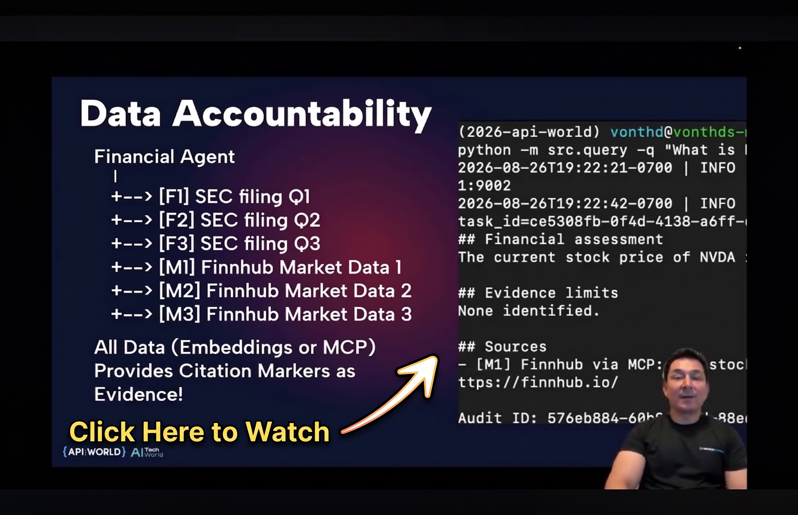

# Agentic AI Using Mixture of Experts (MoE) Architecture

This hands-on lab demonstrates an Agentic AI solution built with an application-level **Mixture of Experts (MoE) architecture**. A central Orchestrator routes each request to the appropriate domain expert, evaluates whether the returned information is sufficient, and uses a bounded reinforcement loop to continue, correct, synthesize, release, or withhold the response.

The lab's example is a technology-company research agent with a focus on financials. It brings together historical and current technology news, SEC filing evidence, and current market data so participants can examine how company announcements and strategy relate to financial outcomes. The architecture separates deterministic policy, specialist authority, evidence retrieval, natural-language generation, and release governance instead of assigning every responsibility to one model.

The Orchestrator communicates with the News and Financials Experts through [Agent2Agent (A2A)](https://github.com/a2aproject/a2a). Each expert uses retrieval-augmented generation (RAG) using [OpenSearch](https://opensearch.org) for governed historical data and [Model Context Protocol (MCP)](https://github.com/github/github-mcp-server) for real-time external data. Citations and audit records preserve evidence provenance across these boundaries.

## Why Mixture of Experts

The Mixture of Experts (MoE) architecture takes a traditional Feed-Forward Network (FFN) and processes it sequentially through layers, transforming the request process into an ensemble of parallel sub-networks, or expert agents (simply dubbed experts), orchestrated by a routing or gating mechanism.

Experts are domain experts in knowledge, but more importantly, in policy, workflow, and decision-making. The non-AI equivalent is a microservices architecture where each microservice is intentionally bound by a single function and where separation of concerns is the model; the generalized concept is [Vertical APIs](https://medium.com/point-nine-news/vertical-apis-308a44ef328e). In microservices, you wouldn't want a microservice to control behavior, policies, or workflows in both finance and healthcare... so why build AI solutions using a single foundational LLM backed by a single agent? This is the shift in how production AI solutions operate versus running [Agent Skills](https://platform.claude.com/docs/en/agents-and-tools/agent-skills/overview) behind a black box.

Experts can communicate with each other via [Agent2Agent (A2A)](https://github.com/a2aproject/a2a) and access tooling via [Model Context Protocol (MCP)](https://github.com/github/github-mcp-server). This hasn't changed. What has changed is the harness code surrounding the Language Model. Harness code is just codified rules, policy, and workflow that keep your Expert focused on your domain, enforce governance, and make your AI solution observable and auditable.

If you are interested in reading more about this, check out these research papers:

- [Small Language Models are the Future of Agentic AI](https://arxiv.org/pdf/2506.02153)
- [Dive into Claude Code: The Design Space of Today's and Future AI Agent Systems](https://arxiv.org/abs/2604.14228)

## Ways to Experience This Lab

| This Lab | Local Laptop | CLI | Notebook | Videos |
|---|---|---|---|---|
| **Agentic AI** | [Getting Started](#getting-started) | _Coming soon:_ Codex Claude Cursor | _Coming soon_ | [Videos](#videos) |

## Episodes

These episodes are cumulative and build on top of one another leading up to the final episode of the client exercising our Agentic research agent.

| Episode | Description | Hands-on Lab |
| --- | --- | --- |
| **1. Introduction to our Agentic Researcher** | Review the architecture, prepare the Python environment, start OpenSearch, and validate the shared services required by the lab. | [Start](1-introduction) |
| **2. News Expert** | Build a governed specialist that combines historical OpenSearch RAG with current technology news retrieved through Tavily MCP. | [Start](2-news-agent) |
| **3. Financial Expert** | Build a governed specialist that combines exact-ticker SEC filing RAG with structured market data retrieved through Finnhub MCP. | [Start](3-financials-agent) |
| **4. Orchestrator Expert** | Route one-company requests to the specialists over A2A, evaluate completion, and synthesize evidence without crossing authority boundaries. | [Start](4-orchestrator-agent) |
| **5. Ask with our Client** | Use the OpenAI-compatible client to exercise news, financial, combined, clarification, and conversational follow-up flows. | [Start](5-client) |

## Getting Started

The lab assembles the solution one boundary at a time. You will first prepare the development environment and OpenSearch, then run each specialist independently before connecting them to the Orchestrator. Every episode will explain what is being started, why it exists, what data crosses its interfaces, what output to expect, and how to diagnose failures before proceeding.

Plan to keep several terminal sessions open as the architecture grows. The complete experience requires a compatible Python environment, OpenSearch, a small historical-news dataset, converted SEC filing samples, Tavily and Finnhub credentials, and either local model weights or compatible OpenAI-style model endpoints. Beginning with the foundation episode keeps those dependencies visible and verifiable before the agent workflows are introduced.

[Start Episode 1: Introduction to our Agentic Technology-company Researcher](1-introduction)

## Learn with Codex, Claude Code, or Cursor

Coming Soon

## Jupyter Notebook

Coming Soon

## Videos

This session was presented at [API World / AI TechWorld 2026 (Sept 2026)](https://apiworld.co/) in a session titled: [Vertical APIs for Agentic AI: Routing the Right Context to the Right Expert](https://bit.ly/4vTjFUi). You can watch the post conference recording by clicking the image below.

*[Click the image to watch this session](https://bit.ly/4iqaYhh)*
