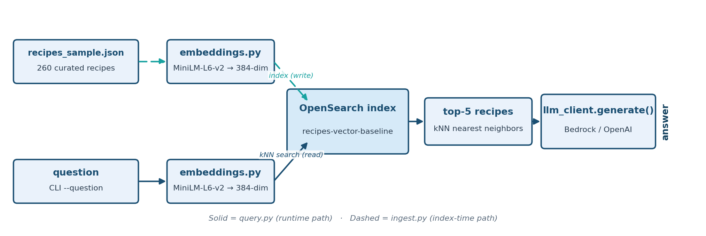

# Stage 1 — Baseline Vector RAG (Recipes)

The first stage in the journey: plain vector (kNN) search over the "Recipe &
Dietary Safety Assistant" dataset, before any fix is applied.

**Wrong, but confident — with real stakes.** Same failure as Stage 1, now
on the actual allergen data: a wrong-but-confident answer here isn't just
an annoying demo bug, it's the exact mistake this whole journey exists to
prevent.

**Teaching goal:** vector search retrieves by *semantic similarity*, not by
*factual correctness*. Two similarly-worded questions can have completely
different correct answers, and pure vector retrieval has no way to know
that -- it just returns "similar-sounding" recipes.

## Architecture



## Dataset

A curated sample of 260 recipes (`recipes/recipes_sample.json`) pulled from
[`datahiveai/recipes-with-nutrition`](https://huggingface.co/datasets/datahiveai/recipes-with-nutrition)
on HuggingFace -- already included, no download step needed.

The sample deliberately includes a **real, naturally-occurring ambiguous pair**
found in the source dataset: two completely different recipes that both happen
to be named **"Fish and Chips"**:

| | Source | Cautions |
|---|---|---|
| Recipe A | thegratefulgirlcooks.com | *(none listed)* |
| Recipe B | womensweeklyfood.com.au | **Sulfites** |

Only Recipe B (which uses beer in its batter) carries a sulfites caution.
This pair was chosen after empirically verifying it actually breaks vector
retrieval, not just because the names match: with the `all-MiniLM-L6-v2`
embedding model, the question about Recipe A scores *higher* against
Recipe B's embedding (0.62) than against its own (0.49) -- a genuine
ranking flip, not just a close call. A secondary, thinner-margin pair
("Chicken Cordon Bleu" -- Skinnytaste vs. sargento.com, soy vs. no-soy) is
also included in the sample for further exploration.

## Why chunking matters (and when)

Chunking is the practice of splitting a document into smaller pieces
*before* embedding and indexing it, so each piece gets its own vector and
can be retrieved independently. It matters because a single embedding
vector represents the *whole* text you feed it -- if that text covers
several distinct facts, the vector becomes an average of all of them, and
retrieval gets worse at matching any one fact precisely.

Take a recipe as an example: its name and ingredient list are one topic
("what's in this dish"). Its full nutrient breakdown is a different one
("how much sodium/potassium/etc. per serving"). Its prep instructions are
a third. Embed all of that as one block of text, and a question about
sodium content competes for relevance against the ingredient list and the
instructions in the same vector -- none of which it's really "about."
Split it into chunks along those natural boundaries instead, and the
sodium question can match specifically against the nutrient-breakdown
chunk, not get diluted by everything else in the document.

Two things determine whether you need this:
- **Document length** -- short documents (a name + a handful of
  ingredients) don't have enough distinct content for a single vector to
  blur together in the first place.
- **Topical density** -- even a short document can need chunking if it
  packs in several unrelated facts a user might ask about independently.

Dataset *size* isn't the deciding factor -- 40,000 short documents don't
need chunking any more than 40 do; it's about how much, and how varied,
the content of *each individual* document is.

A couple of practical details that matter once you do chunk:
- **Overlap** -- chunking with a fixed window (e.g. 200 words) and a
  small overlap (e.g. 40 words) prevents a fact from being cut exactly at
  a chunk boundary and lost from both halves.
- **Self-describing chunks** -- a chunk retrieved on its own loses the
  context of "which recipe is this from?" unless you carry identifying
  fields (name, source, URL) into every chunk's text, not just the first
  one. Otherwise a hit on chunk 3 of 5 is unusable without also fetching
  chunk 1.

## Run it

```bash
source ../.venv/bin/activate   # from repo root: source .venv/bin/activate
cd 01_baseline_vector_rag_recipes

python ingest.py
python query.py --question "Does the thegratefulgirlcooks.com Fish and Chips recipe contain sulfites?"
python query.py --question "Does the womensweeklyfood.com.au Fish and Chips recipe contain sulfites?"
```

## What to look for (verified output)

Asking about **thegratefulgirlcooks.com**'s recipe (the correct answer is
"no sulfites"): vector search's top-5 hits don't include that recipe at
all -- only womensweeklyfood.com.au's same-named recipe shows up. Because
Stage 1's system prompt instructs the model to say "I don't know" when the
context doesn't support an answer, you'll see the assistant correctly
decline rather than hallucinate -- but the *retrieval* still silently failed
to find the one document that actually answers the question. With a looser
system prompt (or a model that ignores it), this is exactly the shape of
failure that produces a confidently wrong safety answer instead.

Asking about **womensweeklyfood.com.au**'s recipe works fine, since that
recipe legitimately ranks near the top of the corpus regardless.

This failure mode is directly tied to dietary safety here -- a dropped or
wrong retrieval isn't just an inaccurate trivia fact, it's the kind of gap
that matters for someone with a sulfite sensitivity. Stage 2's BM25 +
entity retrieval is designed to close this exact gap (verified: it
correctly answers both questions).

## Validate

```bash
python validate.py
```

## Troubleshooting

Setup or runtime issue? See [`TROUBLESHOOTING.md`](../TROUBLESHOOTING.md)
for common fixes (missing `.env` values, certificate errors, Bedrock
model access, etc.).
