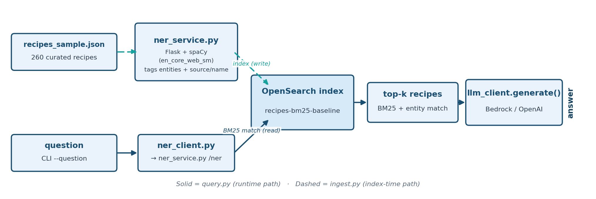

# Stage 2 — Baseline BM25 RAG (Recipes)

Builds on [Stage 1](../01_baseline_vector_rag_recipes/README.md), on the same
"Recipe & Dietary Safety Assistant" dataset.

**Same fix, same cost, higher stakes.** Same trade-off as Stage 2 —
correct answers, but only with a second service running — now on the
theme where a missed allergen actually matters.

**Teaching goal:** BM25 + entity tagging is deterministic and auditable --
the same query keyword either matches a document's text or it doesn't. This
stage's job is to correctly disambiguate the two same-named recipes that
Stage 1's vector search could confuse.

## Architecture



## Dataset

Same curated 260-recipe sample as Stage 1, in `recipes/recipes_sample.json`
-- including the same real, verified ambiguous pair: two "Fish and Chips"
recipes (thegratefulgirlcooks.com, no cautions vs. womensweeklyfood.com.au,
Sulfites) where Stage 1's vector search demonstrably drops the first
recipe from its top-5 results entirely.

Each recipe is tagged at ingest time with entities from the local NER
service, plus its own `source` and `recipe_name` folded directly into the
same `entities` field. This is a deliberate design choice, confirmed by
testing: spaCy's small NER model tags **no useful entity** for
"thegratefulgirlcooks.com" (it only spuriously tags the unrelated word
"chips" as `ORG`), so relying on NER alone would not have disambiguated
these two recipes. The source is already known, deterministic metadata --
there's no reason to leave a disambiguation signal you already have to
chance.

## Run it

Terminal 1 (NER service, stays running):

```bash
source ../.venv/bin/activate
cd 02_baseline_bm25_rag_recipes
python ner_service.py
```

Terminal 2:

```bash
source ../.venv/bin/activate
cd 02_baseline_bm25_rag_recipes

python ingest.py
python query.py --question "Does the thegratefulgirlcooks.com Fish and Chips recipe contain sulfites?"
python query.py --question "Does the womensweeklyfood.com.au Fish and Chips recipe contain sulfites?"
```

## What to look for (verified output)

Compare these answers against Stage 1's. BM25 + entity matching correctly
separates the two recipes because it matches the literal term
"thegratefulgirlcooks.com" or "womensweeklyfood.com.au" rather than relying
on "similar meaning" -- closing the exact gap Stage 1 exposed. Verified
output: it correctly answers "no sulfites" for thegratefulgirlcooks.com and
"yes, sulfites" for womensweeklyfood.com.au, where Stage 1's vector search
couldn't even retrieve the first recipe.

## Validate

With `ner_service.py` still running:

```bash
python validate.py
```

## Troubleshooting

Setup or runtime issue? See [`TROUBLESHOOTING.md`](../TROUBLESHOOTING.md)
for common fixes -- including what to check if `ner_service.py` isn't
running (entity matching silently degrades to plain full-text matching
rather than erroring), missing `.env` values, certificate errors, and
Bedrock model access.
