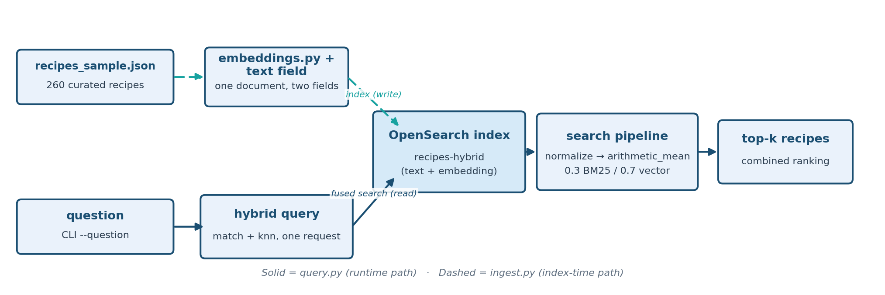

# Stage 3 — Hybrid RAG (Native OpenSearch Search Pipeline)

Recipe-dataset stage building directly on [Stage 1](../01_baseline_vector_rag_recipes/README.md)
and [Stage 2](../02_baseline_bm25_rag_recipes/README.md), but this time BM25
keyword matching and vector semantic search are fused **server-side, in a
single OpenSearch query**, instead of running two separate retrieval systems
and reconciling them yourself.

**Drops the babysitter.** This removes the cost Stage 2 introduced:
instead of keeping a separate service running just to catch what keyword
matching alone would, OpenSearch combines both signals in one request,
natively.

**Teaching goal:** Stage 1 showed vector search can silently drop the
correct document when two recipes share a name. Stage 2 fixed that with
exact keyword/entity matching, but needed a whole extra NER microservice
running alongside it. Stage 3 shows you don't have to choose, and don't need
the extra service: OpenSearch's native `hybrid` query type runs a BM25
`match` and a kNN search in the same request, and a **search pipeline**
normalizes and combines their scores before the results ever leave the
cluster.

## How it works

Unlike Stage 1/2, there is only **one index** here (`recipes-hybrid`), and
each document has both a `text` field (for BM25) and an `embedding` field
(for kNN) — see `ensure_hybrid_index()` in `common/opensearch_client.py`.

Querying uses OpenSearch's `hybrid` query clause with two sub-queries:

```json
{
  "query": {
    "hybrid": {
      "queries": [
        { "match": { "text": "<question>" } },
        { "knn": { "embedding": { "vector": [...], "k": 10 } } }
      ]
    }
  }
}
```

A **search pipeline** (`hybrid-search-pipeline`, created once by `ingest.py`
via `ensure_hybrid_pipeline()`) post-processes the two result sets before
they're merged:

1. `normalization-processor` rescales each sub-query's raw scores onto a
  comparable `[0, 1]` range via **min-max normalization** — BM25 scores and
   cosine/L2 kNN scores otherwise live on completely different scales and
   can't be added together meaningfully.
2. `arithmetic_mean` **combination** then takes a weighted average of the two
  normalized scores: **BM25 weight 0.3, vector weight 0.7** by default. The
   query is still meaning-first (matching Stage 1's semantic recall), but
   the 0.3 BM25 weight is enough to pull an exact source/name match back to
   the top when it matters — see the verified run below.

The same disambiguation trick Stage 2 relied on (folding the recipe's
`source` domain directly into the indexed `text`) is what gives BM25 a
literal term to lock onto here too — but there's no NER service extracting
it into a separate field, since the raw text match is doing the work.

Weights are tunable from the CLI (`--bm25-weight` / `--vector-weight` in
`ingest.py`, which is what (re)creates the pipeline) if you want to see how
leaning further toward BM25 or vector shifts the ranking.

## Architecture



## Dataset

Same curated 260-recipe sample as Stage 1/2, in
`recipes/recipes_sample.json` — including the same real, verified ambiguous
pair: two "Fish and Chips" recipes (`thegratefulgirlcooks.com`, no cautions
vs. `womensweeklyfood.com.au`, Sulfites) where Stage 1's vector search
demonstrably drops the first recipe from its top-5 results entirely.

## Run it

```bash
source ../.venv/bin/activate   # from repo root: source .venv/bin/activate
cd 03_hybrid_rag_native_opensearch

python ingest.py
python query.py --question "Does the thegratefulgirlcooks.com Fish and Chips recipe contain sulfites?"
python query.py --question "Does the womensweeklyfood.com.au Fish and Chips recipe contain sulfites?"
```

No NER service needs to be running for this stage — that's the point.

## What to look for (verified output)

Both questions correctly retrieve their own named recipe in the top 2 hybrid
hits (score = normalized/weighted combination, not raw BM25 or cosine):

```
QUESTION: Does the thegratefulgirlcooks.com Fish and Chips recipe contain sulfites?
  - Fish and chips | source=womensweeklyfood.com.au | score=0.7000
  - Fish and Chips | source=thegratefulgirlcooks.com | score=0.3000
  ...
ANSWER: ...does **not** contain sulfites. The allergen cautions for this recipe list "none listed."

QUESTION: Does the womensweeklyfood.com.au Fish and Chips recipe contain sulfites?
  - Fish and chips | source=womensweeklyfood.com.au | score=1.0000
  ...
ANSWER: Yes, ...**does contain sulfites**. The recipe lists "Sulfites" under its allergen cautions.
```

Compare this to Stage 1, where vector search dropped
`thegratefulgirlcooks.com`'s recipe from the top-5 entirely — here it's
pulled back into the results (2nd place, still behind the more
semantically-central `womensweeklyfood.com.au` match, since vector is
weighted higher) purely because BM25's exact-text match on the source domain
contributes a nonzero combined score. That's the practical effect of the
0.3 BM25 weight: enough to guarantee the right document is *retrieved* even
when it's not the vector-nearest one, without needing a separate NER service
to force it there like Stage 2 did.

## Validate

```bash
python validate.py
```

## Troubleshooting

Setup or runtime issue? See [`TROUBLESHOOTING.md`](../TROUBLESHOOTING.md)
for common fixes (missing `.env` values, certificate errors, Bedrock
model access, etc.).

