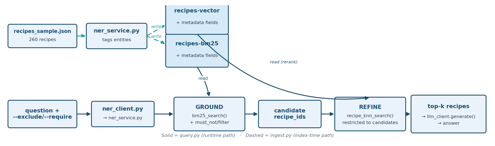

# Stage 4 — Hybrid RAG (External NER + BM25-Grounding + Vector-Refine Rerank)

Recipe-dataset stage building on [Stage 3](../03_hybrid_rag_native_opensearch/README.md), but
solving a gap that Stage 3's native hybrid pipeline can't: **guaranteed hard
exclusions**, e.g. "never recommend a recipe with sulfites."

**Combining two guesses still isn't a guarantee.** Stage 3's hybrid score
blends two signals into one number — but a recipe that says "contains
peanuts" can still outscore one that doesn't, and slip through. This stage
makes exclusions absolute instead of just likely.


**Teaching goal:** Vector similarity and even Stage 3's weighted
BM25+vector hybrid are still *scoring* mechanisms — they can rank a
sulfite-containing recipe lower, but nothing in a similarity score can
*guarantee* a negation like "no sulfites" is honored, because "no sulfites"
and "contains sulfites" can still embed close together, and BM25 keyword
matching has no built-in concept of exclusion either. Stage 4 fixes this
with explicit, generalized `--exclude`/`--require` structured filters
applied as real OpenSearch `must_not`/`filter` clauses — which are boolean,
not scored, so they can't be outvoted by relevance.

## How it works — externally orchestrated two-phase retrieval

Unlike Stage 3's single native `hybrid` query + search pipeline, Stage 4
runs two separate queries across two separate indexes, glued together by
client-side (Python) logic:

1. **GROUND** — `bm25_search()` against `recipes-bm25`: a keyword + NER-entity
   query (same style as Stage 2) that also applies any `--exclude`/`--require`
   filters as hard `must_not`/`filter` clauses. This produces a candidate set
   that is *provably* free of anything excluded — not just down-ranked.
2. **REFINE** — `recipe_knn_search()` against `recipes-vector`, restricted via
   `include_recipe_ids` to exactly the grounding set's candidate IDs (plus the
   same filters again, for defense-in-depth). This re-ranks the
   already-safe candidates by semantic similarity to the question, so the
   final top-k is both constraint-compliant *and* relevant.

Both indexes are populated by `ingest.py` from the same 260-recipe sample
used by Stage 1/2/3, tagged with the same structured metadata
(`cautions`, `diet_labels`, `cuisine_type`, `meal_type`, `dish_type`) so
filters behave identically against either index. The generalized field
aliases (`allergen`→`cautions`, `diet`→`diet_labels`, `cuisine`→`cuisine_type`,
etc., see `FILTERABLE_FIELDS` in `common/opensearch_client.py`) mean any of
these can be excluded or required from the CLI — not just one hardcoded flag.

## Architecture



## Dataset

Same curated 260-recipe sample as Stage 1/2/3, in
`recipes/recipes_sample.json`. Of the 260 recipes, **201 carry a "Sulfites"
caution** — a large enough majority that a plain, unfiltered "fish and
chips" query legitimately surfaces a sulfite-containing recipe as the
top result, making it a genuine (not contrived) test of the exclusion
guarantee below.

## Run it

Terminal 1 (NER service, stays running — the same one Stage 2 uses):

```bash
source ../.venv/bin/activate
cd 02_baseline_bm25_rag_recipes
python ner_service.py
```

Terminal 2:

```bash
source ../.venv/bin/activate
cd 04_hybrid_rag_external_ner_rerank

python ingest.py

# No hard filter -- both "Fish and Chips" recipes are eligible
python query.py --question "Suggest a British fish and chips recipe."

# Hard-exclude anything with sulfites
python query.py --question "Suggest a British fish and chips recipe." --exclude allergen=Sulfites

# --require works the same way, e.g.:
python query.py --question "Suggest a dinner idea." --require cuisine=italian --require diet=Low-Carb
```

## What to look for (verified output)

**Without a filter**, the sulfite-containing recipe legitimately wins both
stages — this is the *correct*, unforced behavior when nothing says to avoid
it:

```
GROUNDING (BM25, top 2 of 25):
  - Fish and Chips | source=thegratefulgirlcooks.com | cautions=[]          | score=22.1129
  - Fish and chips | source=womensweeklyfood.com.au  | cautions=['Sulfites'] | score=22.1129
REFINED (vector rerank, top 2 of 5):
  - Fish and chips | source=womensweeklyfood.com.au  | cautions=['Sulfites'] | score=0.7941
  - Fish and Chips | source=thegratefulgirlcooks.com | cautions=[]          | score=0.7691
ANSWER: presents BOTH recipes, sulfites and all, as valid options.
```

**With `--exclude allergen=Sulfites`**, the sulfite-containing recipe is
gone from *both* the 25-candidate grounding set and the final refined
results — not just pushed down:

```
GROUNDING (BM25, top result of 25):
  - Fish and Chips | source=thegratefulgirlcooks.com | cautions=[] | score=22.1129
REFINED (vector rerank, top result of 4):
  - Fish and Chips | source=thegratefulgirlcooks.com | cautions=[] | score=0.7691
ANSWER: recommends ONLY thegratefulgirlcooks.com's recipe, correctly noting it has no allergen cautions.
```

This is the practical difference between "hybrid scoring" (Stage 3, where
sulfite-free wasn't even an option the system could be told to enforce) and
"hybrid scoring + hard constraints" (Stage 4): the exclusion isn't a
preference the ranking might honor, it's a guarantee.

## Validate

With `ner_service.py` still running:

```bash
python validate.py
```

`validate.py` asserts the exclusion guarantee directly: every recipe in
both the grounding set and the refined set must NOT carry the excluded
caution, for every recipe in the corpus that does carry it.

## Troubleshooting

Setup or runtime issue? See [`TROUBLESHOOTING.md`](../TROUBLESHOOTING.md)
for common fixes -- including what to check if `ner_service.py` isn't
running (entity matching silently degrades to plain full-text matching
rather than erroring), missing `.env` values, certificate errors, and
Bedrock model access.
