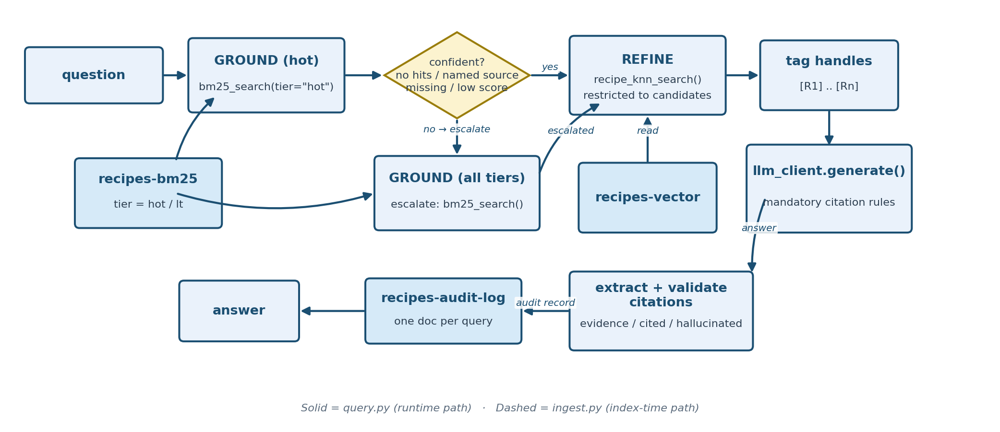

# Stage 5 — Governance-Driven Hot / Long-Term (LT) Tiering

Recipe-dataset stage building on [Stage 4](../04_hybrid_rag_external_ner_rerank/README.md).
Reuses Stage 4's exact same `recipes-bm25` / `recipes-vector` indexes (see the
comment in `common/config.py`), but this time every recipe gets a real `tier`
value instead of Stage 4's placeholder `"hot"` default, and every query is
recorded in a governance audit trail.

**Not all data is equally safe to demote.** This is the mistake of tiering
data by cost alone without checking whether some of it is safety-critical
— plus the "why did it say that?" problem: this stage adds the record
you'd need to answer that question after the fact.


**Teaching goal:** "Tiering" (splitting data into a fast/default tier and a
slower/archival tier) is usually framed as a pure cost/performance
optimization. This stage frames it as a **governance decision instead**:
which data is *not allowed* to be relegated to the slow/optional path, and
how do you prove — after the fact — that a query correctly reached the data
it needed to?

## The tiering policy

```python
def assign_tier(recipe: dict) -> str:
    """Governance policy: any allergen caution -> hot (always fast-reachable);
    no cautions listed -> lt (long-term/archive tier)."""
    return "hot" if recipe.get("cautions") else "lt"
```

Any recipe with an allergen caution (Sulfites, Wheat, Soy, ...) is `tier=hot`
— safety-relevant data must always be in the default, low-latency search
path. Recipes with **no** cautions are `tier=lt` — lower priority, since
getting one of those slightly slower or via a fallback path has no safety
consequence. Of the 260-recipe sample: **209 are `hot`, 51 are `lt`.**

This is the opposite of the usual "hot = recent/popular" heuristic — the
policy is driven by a compliance requirement, not by traffic patterns. That
inversion is the point: the *governance* rule decides the *tiering* rule,
not the other way around.

## Query flow: hot-first, escalate on low confidence

`query.py` builds directly on Stage 4's ground (BM25) → refine (vector)
pipeline, adding a tiering decision before the grounding step:

1. Run the BM25 grounding query **restricted to `tier=hot`** (same
   `bm25_search()` helper as Stage 4, now passing `tier="hot"`).
2. **Escalate** to a second grounding query across **all tiers** (no tier
   filter) if the hot-tier search wasn't confident. Three independent
   triggers, in order of how they're checked:
   - **No hot candidates at all.**
   - **A specific source is named in the question but isn't present among
     the hot-tier results** (`named_source_not_in_hot_tier`). This one
     matters in practice: a generic BM25 score can be high just from
     matching the recipe *name* (e.g. "Fish and Chips" appears in both the
     hot and lt copies), even when the *specific* source the user asked
     about was never actually found. Checking the aggregate top score alone
     isn't enough — the question is parsed for anything that looks like a
     domain (`thegratefulgirlcooks.com`) and that's checked directly
     against the hot-tier hits' `source` field.
   - **Low confidence otherwise**: fewer than `TIER_MIN_HOT_CANDIDATES`
     (default 3) hits, or a top BM25 score below `TIER_MIN_HOT_SCORE`
     (default 15.0) — tuned against this corpus's real scores, where an
     exact name/source match scores ~22–28 and a loose incidental
     word-overlap match scores ~3–9.
3. Vector-refine (same as Stage 4) over whichever candidate set resulted,
   restricted to those recipe IDs. One subtlety fixed during testing: kNN's
   `include_recipe_ids` filter is a *post*-filter over OpenSearch's top-N
   nearest neighbors, so the refine step asks for a large neighbor pool
   (`REFINE_ANN_POOL = 300`, bigger than the whole corpus) rather than a
   small one — otherwise a grounding candidate with weak *vector* similarity
   to the question (exactly the failure Stage 1 demonstrated) could be
   correctly found by BM25 grounding and then silently dropped again by an
   under-sized vector refine step.
4. Generate the answer via Bedrock.
5. **Write a governance audit record** to a new `recipes-audit-log` index
   (`ensure_audit_index()` / `log_audit_event()` in
   `common/opensearch_client.py`) capturing: the question, extracted
   entities, any `--exclude`/`--require` filters, which tier(s) were
   searched, whether escalation happened and why, candidate/result counts,
   the final recipe IDs/sources/cautions returned, the answer, and latency.
   This is the compliance trail: you can always answer "did this query reach
   the archive tier, and why (not)?" after the fact by querying
   `recipes-audit-log` itself.

## Output-level governance: citation-tagging

The tiering/escalation/audit-log trail above answers "did this query reach
the right *data*, and why?" It doesn't answer a related question: "which
retrieved chunk backs *this specific sentence* in the answer?" This stage
adds that second, complementary governance signal on top of the first.

Every recipe handed to the LLM is tagged with a stable handle (`[R1]`,
`[R2]`, ...) in `_build_context()`, in the same order as `refined_hits` (and
therefore the same order as `refined_recipe_ids` in the audit record, so a
handle can always be mapped back to a recipe ID from the audit log alone).
`_build_system_prompt()` then makes citing those handles mandatory:

```python
def _build_system_prompt(allowed_handles: List[str]) -> str:
    ...
    allowed = " ".join(f"[{h}]" for h in allowed_handles)
    return (
        BASE_SYSTEM_PROMPT + " CITATION RULES (mandatory): each recipe snippet in the "
        f"context is wrapped in a handle tag like [R1]. Allowed citation tags for this "
        f"answer: {allowed}. After every sentence containing a factual recipe claim, "
        "append the [R#] tag(s) for the snippet(s) that support it. Use opening tags "
        "only (e.g. [R1]) -- never closing tags like [/R1]. Never invent a tag that is "
        "not in the allowed list above."
    )
```

After Bedrock responds, `_extract_cited_handles()` parses every `[R#]` tag
out of the generated answer, and the handles it finds are checked against
the handles that were actually retrieved:

- `evidence_handles` — every handle that was made available to the LLM.
- `cited_handles` — every handle the LLM actually used, in first-seen order.
- `hallucinated_citations` — any cited handle **not** in `evidence_handles`
  (i.e. a citation the model invented rather than grounded).
- `citations_valid` — `True` iff `hallucinated_citations` is empty.

All four are written into `governance_meta` (printed by `query.py`) *and*
into the same `recipes-audit-log` record as the tiering fields, so a single
audit document captures both governance layers: which tier(s) were
searched and why, and whether the final answer's citations were honest.

## Architecture



## Dataset

Same curated 260-recipe sample as Stage 1/2/3/4, in
`recipes/recipes_sample.json`. The running "Fish and Chips" pair splits
across tiers by design:

| | Source | Cautions | Tier |
|---|---|---|---|
| Recipe A | thegratefulgirlcooks.com | *(none listed)* | **lt** |
| Recipe B | womensweeklyfood.com.au | Sulfites | **hot** |

Asking specifically about Recipe A should therefore require escalation
(it's excluded from a hot-only search), while Recipe B should resolve
without ever touching the LT tier.

## Run it

Terminal 1 (NER service, stays running):

```bash
source ../.venv/bin/activate
cd 02_baseline_bm25_rag_recipes
python ner_service.py
```

Terminal 2:

```bash
source ../.venv/bin/activate
cd 05_governance_hot_lt_tiering

python ingest.py

# Hot-tier recipe -- should resolve without escalating
python query.py --question "Does the womensweeklyfood.com.au Fish and Chips recipe contain sulfites?"

# LT-tier recipe -- should escalate to find it
python query.py --question "Does the thegratefulgirlcooks.com Fish and Chips recipe contain sulfites?"

# --exclude/--require from Stage 4 still work, combined with tiering
python query.py --question "Suggest a British fish and chips recipe." --exclude allergen=Sulfites
```

## What to look for (verified output)

**Hot-tier recipe** (womensweeklyfood.com.au, has a Sulfites caution) —
resolves without ever touching the LT tier, and the answer cites exactly
the retrieved recipe that backs it (`[R1]`), with no hallucinated tags:

```
GOVERNANCE: tiers_searched=['hot'] escalated=False reason=None hot_hits=25 hot_top_score=22.1129
CITATIONS: evidence=['R1', 'R2', 'R3', 'R4', 'R5'] cited=['R1'] hallucinated=[] valid=True
ANSWER: Yes, the womensweeklyfood.com.au Fish and Chips recipe contains sulfites. [R1] The
recipe is marked with a sulfites caution in its allergen information. [R1]

REFINED (vector rerank, top 5):
  - [R1] Fish and chips | source=womensweeklyfood.com.au | tier=hot | cautions=['Sulfites'] | score=0.8318
  - [R2] End-of-the-Rainbow Cookies | source=Martha Stewart | tier=hot | cautions=['Soy', 'Sulfites'] | score=0.7621
  ...
```

**LT-tier recipe** (thegratefulgirlcooks.com, no cautions) — the hot-only
grounding search's top hit is the *other* Fish and Chips recipe (score
22.11, since the recipe *name* matches regardless of source), but the named
source isn't among the hot-tier results, so the system escalates and finds
the correct recipe in the LT tier at a *higher* score (28.11, since its
source name matches too). The final answer correctly cites `[R4]` — the
handle assigned to the *escalated*, LT-tier recipe — not `[R1]`, the
hot-tier recipe that merely shares a name:

```
GOVERNANCE: tiers_searched=['hot', 'lt'] escalated=True reason=named_source_not_in_hot_tier hot_hits=25 hot_top_score=22.1129
CITATIONS: evidence=['R1', 'R2', 'R3', 'R4', 'R5'] cited=['R4'] hallucinated=[] valid=True
ANSWER: No, the thegratefulgirlcooks.com Fish and Chips recipe does not contain sulfites. [R4]
The recipe lists "none listed" for allergen cautions, and sulfites are not mentioned among
the ingredients or health warnings.

REFINED (vector rerank, top 5):
  - [R1] Fish and chips | source=womensweeklyfood.com.au | tier=hot | cautions=['Sulfites'] | score=0.8265
  - [R2] End-of-the-Rainbow Cookies | source=Martha Stewart | tier=hot | cautions=['Soy', 'Sulfites'] | score=0.7671
  - [R3] Chorizo And Shrimp Rice Recipe | source=Food Republic | tier=hot | cautions=['Sulfites'] | score=0.7645
  - [R4] Fish and Chips | source=thegratefulgirlcooks.com | tier=lt | cautions=[] | score=0.7597
  - [R5] Harry Potter's Pumpkin Juice - the Healthy Halloween Treat | source=kidsactivitiesblog.com | tier=hot | cautions=['Sulfites'] | score=0.7565
```

**Combined with a hard filter** — `--exclude allergen=Sulfites` on a generic
"suggest a fish and chips recipe" question removes the hot-tier recipe from
the candidate pool entirely, which *also* triggers escalation (this time via
the generic low-confidence-score path, since the remaining hot-tier
candidates are all weak matches):

```
python query.py --question "Suggest a British fish and chips recipe." --exclude allergen=Sulfites
GOVERNANCE: tiers_searched=['hot', 'lt'] escalated=True reason=low_confidence_hot_score hot_hits=8 hot_top_score=6.9195
ANSWER: I can suggest the Fish and Chips recipe from thegratefulgirlcooks.com...
```

Every call also writes one document to `recipes-audit-log` — verified by
querying the index directly after these runs: each record captures the
question, entities, filters, `tiers_searched`, `escalated`/`escalation_reason`,
the refined recipe IDs/sources/cautions, `evidence_handles`/`cited_handles`/
`hallucinated_citations`/`citations_valid`, the answer, and latency, so you
can answer both "did this query reach the archive tier, and why (not)?" and
"did the answer's citations actually match what was retrieved?" for any past
question without re-running anything.

## Validate

With `ner_service.py` still running:

```bash
python validate.py
```

`validate.py` asserts three things:
1. **Citation mechanism itself** (no live services needed): `[R#]` tags are
   parsed correctly out of a sample answer, and a citation for a handle that
   was never retrieved is correctly flagged as hallucinated.
2. **Hot-tier recipe** resolves with `escalated=False`, `tiers_searched=["hot"]`,
   and the live Bedrock answer cites at least one retrieved handle with no
   hallucinated citations (`citations_valid=True`).
3. **LT-tier recipe** resolves with `escalated=True`, `"lt" in tiers_searched`,
   the correct recipe is actually present in the final results, and again
   the live answer's citations are valid.

Verified run:

```
[PASS] Stage 5 citation extraction and hallucination detection work as expected
[PASS] Stage 5 answered the hot-tier recipe without escalating: meta={'tiers_searched': ['hot'], 'escalated': False, 'escalation_reason': None, 'hot_hit_count': 25, 'hot_top_score': 22.112926, 'evidence_handles': ['R1', 'R2', 'R3', 'R4', 'R5'], 'cited_handles': ['R1'], 'hallucinated_citations': [], 'citations_valid': True}
[PASS] Stage 5 escalated to the LT tier and found the correct recipe: meta={'tiers_searched': ['hot', 'lt'], 'escalated': True, 'escalation_reason': 'named_source_not_in_hot_tier', 'hot_hit_count': 25, 'hot_top_score': 22.112926, 'evidence_handles': ['R1', 'R2', 'R3', 'R4', 'R5'], 'cited_handles': ['R4'], 'hallucinated_citations': [], 'citations_valid': True}
```

## Troubleshooting

Setup or runtime issue? See [`TROUBLESHOOTING.md`](../TROUBLESHOOTING.md)
for common fixes -- including what to check if `ner_service.py` isn't
running (entity matching silently degrades to plain full-text matching
rather than erroring), missing `.env` values, certificate errors, and
Bedrock model access.
