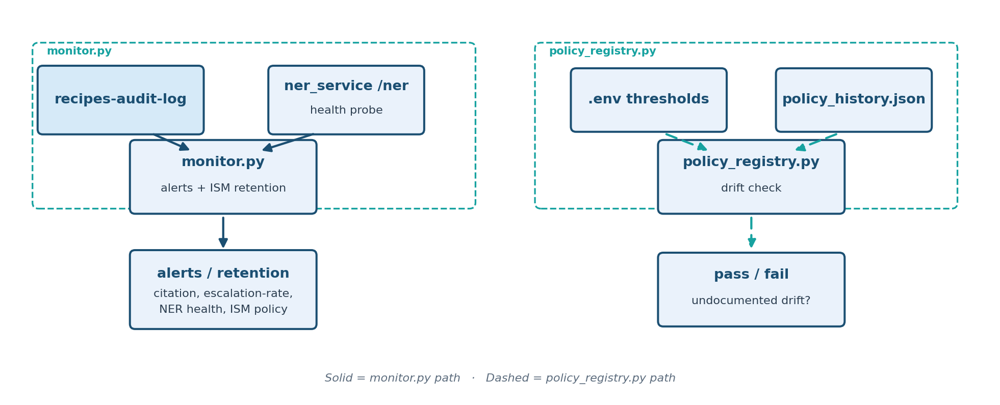

# Stage 6 — Harden for Production (`06_operationalize_production/`)

Unlike Stages 1–5, this stage is **not new RAG retrieval code**. The
underlying infrastructure (Instaclustr OpenSearch + AWS Bedrock) was adopted
all the way back in Stage 1; this stage is an **operational hardening
pass** over everything already built, expanded to cover the governance
artifacts [Stage 5](../05_governance_hot_lt_tiering/README.md) introduced
(the `recipes-audit-log` audit trail, citation-validity checking, and the
hot/LT tiering policy) that didn't exist when this stage was originally
scoped.

**A governance signal nobody watches is worthless.** Stage 5 built the
record you'd need to answer "why did it say that?" — this stage makes sure
someone (and something automated) is actually watching it, and that the
infrastructure underneath isn't handing out more access than it needs.


**Teaching goal:** retrieval quality (Stages 1–4) and governance signals
(Stage 5) are worthless in production if nobody is watching them, nobody
controls who can write/delete them, and the infrastructure underneath is
over-privileged. This stage draws an explicit line between:

- **What this stage automates** — code you can actually run, with a
  `validate.py` smoke test, like every other stage.
- **What stays a manual/infra checklist** — things that require
  cluster-admin or AWS-console access this codebase's app credentials
  intentionally don't hold, and so can only ever be a documented,
  reviewable checklist item, not a script.

## Architecture



## A. Infrastructure & access control *(checklist — manual/infra action)*

These are unchanged from the original plan; nothing here is automated by
this stage's code because they require access beyond the app's own
OPENSEARCH_USER/PASSWORD and AWS credentials in `.env`.

- **Scope IAM to the specific Bedrock model ARN(s) actually in use**, not a
  broad `bedrock:InvokeModel` grant over `*`. See
  [`hardening/bedrock_invoke_policy.json`](hardening/bedrock_invoke_policy.json)
  for the exact policy shape to attach (fill in your `.env`'s `AWS_REGION`
  / `BEDROCK_MODEL_ID`).
- **Role-based OpenSearch security** instead of one shared cluster
  credential. See [`hardening/opensearch_roles.json`](hardening/opensearch_roles.json)
  for four illustrative roles (`recipe_writer`, `recipe_reader`,
  `audit_writer`, `audit_admin`) that separate ingest/query/audit-review
  access, each documented with *why* it's scoped that way.
- **Backup / point-in-time-recovery (PITR) verification** on the
  Instaclustr cluster — confirm snapshots are configured *and* actually
  restorable (via the Instaclustr console; not something this repo's app
  credentials can check).
- **Per-tenant index isolation** — not yet applicable; this project is
  single-tenant today. Revisit if/when that changes.
- **Secrets handling** — move `.env`'s plaintext Instaclustr/AWS
  credentials to a real secrets manager (e.g. AWS Secrets Manager or SSM
  Parameter Store), loaded at process start instead of committed to a local
  file. Not wired up here since it requires provisioning AWS resources this
  repo doesn't own; the change is a few lines in `common/config.py`'s
  `_load_env_once()` once you have a secret to point it at.

## B. Governance-signal monitoring *(automated — [`monitor.py`](monitor.py))*

Stage 5 made sure every query *writes* a governance audit record. Nothing
before this stage ever *read* them back proactively. `monitor.py` queries
`recipes-audit-log` and alerts (non-zero exit code + printed detail) on:

- **Citation-validity**: any `citations_valid=False` record in the lookback
  window, with sample question/answer pairs printed for review. The
  *response policy* (block the answer? auto-retry? human review queue?) is
  a decision this surfaces but deliberately doesn't make for you — right
  now a hallucinated citation is only ever recorded, never acted on; this
  is the first step toward acting on it.
- **Escalation-rate drift**: `escalated`/`escalation_reason` rate over the
  window, alerting if it exceeds `GOVERNANCE_MAX_ESCALATION_RATE` — a
  leading indicator that newly-ingested "hot" data is missing a caution it
  should have, or that the hot/LT split has shifted unexpectedly.
- **NER service availability**: `ner_service.py` has no restart policy and
  no dedicated health route; this probes the real `/ner` endpoint and
  alerts if it isn't answering (Stage 2/4/5 silently degrade to
  unfiltered full-text matching when NER is down, rather than failing
  loudly).

## C. Audit-log hardening *(automated — [`monitor.py`](monitor.py) + `common/opensearch_client.py`)*

- **Retention / ILM policy**: `common.opensearch_client.ensure_audit_retention_policy()`
  attaches an OpenSearch Index State Management (ISM) policy to
  `recipes-audit-log` that deletes documents older than
  `AUDIT_RETENTION_DAYS` (default 180) — currently the index grows
  unbounded with no lifecycle policy at all.
- **Write/delete access separation**: see the `audit_writer` /
  `audit_admin` roles in `hardening/opensearch_roles.json` (A, above) — an
  audit trail that the same credential can write *and* delete/edit isn't
  trustworthy for compliance.

## D. Governance-policy change control *(automated — [`policy_registry.py`](policy_registry.py))*

`assign_tier()`'s rule and the `TIER_MIN_HOT_SCORE` /
`TIER_MIN_HOT_CANDIDATES` thresholds it depends on (Stage 5) define what
counts as "safety-critical" data, yet lived only in code and `.env` with no
change history. [`policy_history.json`](policy_history.json) is the
checked-in record of every approved version; `policy_registry.py` checks
the currently configured thresholds against the latest approved entry and
fails loudly on undocumented drift. It deliberately does **not** catch
changes to `assign_tier()`'s qualitative rule itself (only the two numeric
thresholds are machine-checkable from `.env`) — a code-review requirement
on `05_governance_hot_lt_tiering/ingest.py`'s `assign_tier()` is the other
half of this control.

## E. General operational readiness *(checklist — manual/infra action)*

- **Latency**: already captured per-query as `latency_ms` in
  `recipes-audit-log` (Stage 5) — build any latency alarm from that raw
  signal rather than re-instrumenting.
- **Error rates / cost**: Bedrock invoke errors and spend are visible in
  AWS CloudWatch's `bedrock-runtime` metrics; wire a CloudWatch alarm
  against your account, not something this repo's app credentials can set
  up on their own.

## Run it

Terminal 1 (NER service, stays running — reused as `monitor.py`'s health
probe target):

```bash
source ../.venv/bin/activate
cd 02_baseline_bm25_rag_recipes
python ner_service.py
```

Terminal 2 — run Stage 5 first so `recipes-audit-log` has real data to
monitor (skip if you've already run Stage 5's `query.py` a few times):

```bash
source ../.venv/bin/activate
cd 05_governance_hot_lt_tiering
python query.py --question "Does the womensweeklyfood.com.au Fish and Chips recipe contain sulfites?"
```

Then, from `06_operationalize_production/`:

```bash
source ../.venv/bin/activate
cd 06_operationalize_production

# B/C: check for governance alerts, and (idempotently) ensure the audit
# index has a retention policy attached.
python monitor.py

# D: check .env's tiering thresholds against the approved policy history.
python policy_registry.py
```

`monitor.py` exits `1` if it finds any alert (hallucinated citation,
escalation-rate drift, or an unhealthy NER service) — safe to wire into a
cron job or CI check. `policy_registry.py` exits `1` on undocumented
threshold drift.

## Validate

```bash
python validate.py
```

`validate.py` asserts:
1. **Alert decision logic** (no live services needed): a synthetic
   hallucination and a synthetic escalation-rate spike are each correctly
   flagged by `monitor.evaluate_alerts()`, and a clean/healthy input
   produces no alerts.
2. **Policy drift detection** (no live services needed): a temporary
   history file with thresholds matching `.env` is reported in-sync; one
   with different thresholds is correctly flagged as drifted.
3. **Audit retention policy** (live cluster): `ensure_audit_retention_policy()`
   runs idempotently against the real `recipes-audit-log` index. If the
   cluster's ISM plugin is unavailable, this is reported rather than
   treated as a hard failure (see A, above).
4. **Live governance stats** (live cluster): `audit_log_governance_stats()`
   returns well-formed rates (each in `[0, 1]`) against whatever real audit
   data Stage 5 has already written.

## Troubleshooting

Setup or runtime issue? See [`TROUBLESHOOTING.md`](../TROUBLESHOOTING.md)
for common fixes -- including what to check if `ner_service.py` isn't
running (entity matching silently degrades to plain full-text matching
rather than erroring), missing `.env` values, certificate errors, and
Bedrock model access.
