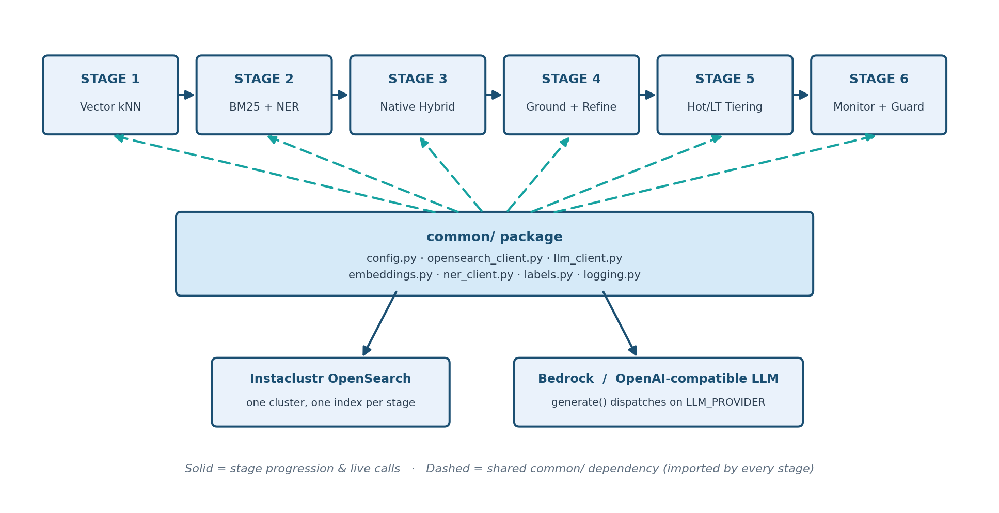

# Architecture

This describes the pieces every stage shares (`common/`), how they connect
to the two pieces of real infrastructure (Instaclustr OpenSearch, AWS
Bedrock), and the index-naming scheme that lets every stage share one
cluster without colliding. For what each *stage* does differently, see the
[top-level README](README.md)'s stage table and each stage's own
`README.md`.

## The shared `common/` package

Every stage's `ingest.py`/`query.py` imports from `common/` rather than
reimplementing connection/config/model logic per stage. This is the single
biggest reason a new stage is typically <200 lines: it only has to define
its *retrieval logic*, never its plumbing.

| Module | Responsibility |
|---|---|
| `common/config.py` | Loads every setting from one root `.env` into a single `Settings` dataclass. `require_configured()` fails fast with one actionable message instead of a raw connection traceback if `.env` is missing real values. |
| `common/opensearch_client.py` | `create_client()` (the one OpenSearch client factory every stage uses) + every index-mapping/query-builder function, organized by stage in comment-delimited sections. This is the largest shared module and the one most stages extend. |
| `common/llm_client.py` | `generate()` — the one function every stage calls to get a completion. Dispatches to Amazon Bedrock or an OpenAI-compatible endpoint based on `LLM_PROVIDER` in `.env`. |
| `common/embeddings.py` | `EmbeddingModel` — wraps `sentence-transformers`, cached per process. |
| `common/ner_client.py` | `NERClient` — calls the local `ner_service.py` Flask service and normalizes results; network/service failures degrade to an empty entity list rather than raising, so a flaky NER call never takes down ingest or query. |
| `common/labels.py` | `normalize_values()` — case/whitespace normalization so `"Sulfites"`, `"sulfites"`, `" Sulfites "` all resolve to the same filter term. |
| `common/logging.py` | One `get_logger()` used everywhere, with third-party HTTP libraries quieted below `DEBUG`. |
| `common/__init__.py` | Runs on import, before anything else: merges the macOS System keychain's trusted roots into a local CA bundle. This exists because Python installed via the official python.org `.pkg` and corporate TLS-inspecting proxies (Zscaler, Netskope, ...) both cause `CERTIFICATE_VERIFY_FAILED` even on an unrestricted network — see `TROUBLESHOOTING.md`. |

## Infrastructure choices, and why

**Instaclustr-hosted OpenSearch**, not a local container. Every stage's
`create_client()` connects to the same cluster, over HTTPS, with basic
auth from `.env`. Using one real hosted cluster from Stage 1 onward means
the *retrieval architecture* is what's being taught, not "how do I run
OpenSearch locally" — and the same setup carries all the way to Stage 6's
production-hardening checklist without a rewrite.

**AWS Bedrock, or an OpenAI-compatible endpoint** — not a local GGUF model
(unlike the reference workshop this project is adapted from).
`common/llm_client.py`'s `generate()` is the only function every stage
calls to get a completion; it dispatches to one of two isolated branches
based on `LLM_PROVIDER` in `.env`:

- `bedrock` (default) — the Anthropic Messages API request/response shape
  (Bedrock's expected format for Claude models), via `boto3`.
- `openai` — a plain `requests.post()` to any OpenAI-compatible
  `/chat/completions` endpoint (OpenAI itself, or an alternate provider
  that speaks the same API), for anyone without Bedrock/AWS access. No new
  SDK dependency, and fully import-isolated from the Bedrock branch.

No other module depends on either provider's wire format, only on
`generate()`'s signature — so no stage's `ingest.py`/`query.py` changes
regardless of which provider is selected.

**A small, local embedding model** (`sentence-transformers/all-MiniLM-L6-v2`,
~90MB, 384 dimensions), not the reference workshop's Qwen3-Embedding-0.6B.

*Memory budget:* MiniLM's ~90MB model plus the small `en_core_web_sm`
spaCy model (~13MB) both run comfortably on CPU, with no GPU and no
macOS-specific tuning — the explicit goal is that every stage runs on a
laptop, not just on infrastructure with a GPU available. A larger
embedding model would improve retrieval quality slightly but isn't
necessary to demonstrate any of the six stages' failure modes/fixes, so it
isn't worth the extra setup friction.

**A local spaCy NER microservice** (`ner_service.py`, Flask, `en_core_web_sm`),
not a managed NLP API. It's deliberately kept local and lightweight (no
GPU, ~13MB model) since, unlike the vector/LLM pieces, there's no benefit
to moving something this small to managed infrastructure. It exposes one
route, `POST /ner`, and every stage that needs it (2, 4, 5) talks to it
through `common/ner_client.py`'s `NERClient`, which swallows connection
failures into an empty entity list rather than propagating them — see
Stage 6's `monitor.py` for why that silent degradation is worth watching
for explicitly, in production.

## Configuration: one `.env`, every stage

There is exactly one `.env` (copied from `.env.example`) at the repo root,
loaded once by `common/config.py`'s `load_settings()`. Every stage reads
from the same `Settings` dataclass; what differs per stage is *which*
fields it actually uses (e.g. only Stage 5/6 read
`TIER_MIN_HOT_SCORE`/`TIER_MIN_HOT_CANDIDATES`). This is why adding a new
env var for a new stage (e.g. Stage 6's `AUDIT_RETENTION_DAYS`) is a
two-line change to `Settings` + `load_settings()`, not a new config
system.

## Index naming: one cluster, many indexes

Every stage shares the *same* Instaclustr cluster but writes to its own
index (or pair of indexes), so stages never collide and can be run/re-run
independently:

| Index (default name) | Used by | Shape |
|---|---|---|
| `recipes-vector-baseline` | Stage 1 | Plain `knn_vector` index over recipes |
| `recipes-bm25-baseline` | Stage 2 | BM25 text + NER-tagged `explicit_terms` over recipes |
| `recipes-hybrid` | Stage 3 | One index, both a `text` field and a `knn_vector` field, queried through a native `hybrid` search pipeline |
| `recipes-bm25` / `recipes-vector` | Stages 4 & 5 | Two separate indexes with the full structured-metadata mapping (`cautions`, `diet_labels`, `cuisine_type`, `meal_type`, `dish_type`, and — from Stage 5 on — `tier`) |
| `recipes-audit-log` | Stages 5 & 6 | One document per query: tiering decision, escalation, citation validity, latency — see Stage 5's README for the full field list |

All index-mapping and query-builder functions live in
`common/opensearch_client.py`, grouped under comment headers by which
stage introduced them (e.g. `# Stage 4/5: BM25-grounding + vector-refine
recipe indexes ...`) — that file is effectively a running architectural
history of the whole project.

## The retrieval progression, architecturally

Each stage is one architectural change, isolated so its effect is
independently verifiable:

1. **Stage 1** — single retrieval mechanism (vector kNN only).
2. **Stage 2** — a second, independent mechanism (BM25 + NER entities)
   run *instead of* vector search, requiring a client to pick one.
3. **Stage 3** — both mechanisms fused **server-side**, in one OpenSearch
   `hybrid` query + search pipeline (`ensure_hybrid_pipeline()`), so the
   client just gets one already-combined ranking.
4. **Stage 4** — both mechanisms run as **two separate phases**
   (`bm25_search()` grounds with hard boolean filters, `recipe_knn_search()`
   refines by similarity), because Stage 3's single fused *score* can't
   express a non-negotiable exclusion like "never sulfites" — a filter is
   boolean, a score is not.
5. **Stage 5** — the same two-phase pipeline, but which tier is searched
   first (and whether to escalate) is now decided by a **governance
   policy** (`assign_tier()`) rather than by relevance alone, and every
   query writes a compliance record.
6. **Stage 6** — no new retrieval mechanism; it's the operational layer
   that watches Stage 5's audit trail, retires old records, and guards the
   tiering policy's thresholds against undocumented change. See its
   `README.md` for the automated-vs-manual breakdown.

## Data

- Recipe dataset (Stage 1 onward — the main path): a curated 260-recipe
  sample (`recipes/recipes_sample.json`, duplicated per stage directory)
  pulled from [`datahiveai/recipes-with-nutrition`](https://huggingface.co/datasets/datahiveai/recipes-with-nutrition)
  on HuggingFace. The sample is committed directly, so `HF_TOKEN` in
  `.env.example` is only needed if you want to regenerate it from the
  source dataset yourself.
